# Full-Custom 8-Bit Microprocessor Core in 65 nm CMOS

Yi-Hsiang Wei and Zijian Shang  
Department of Electrical Engineering, Columbia University  
VLSI Design Project

## Abstract

This report presents the layout, physical verification, and waveform-level functional verification of a full-custom 8-bit microprocessor core in 65 nm CMOS. The processor integrates a PLA-based instruction decoder, a control-signal latch, an 8-by-8 SRAM, an arithmetic datapath, a shifter, an accumulator latch, a multiplexer, and a bidirectional external bus interface.

The instruction set supports eight operations: `NOP`, `LOAD`, `STORE`, `GET`, `PUT`, `ADD`, `SUB`, and `SHIFT`. The included figures document the top-level schematic, layout views, DRC/LVS verification captures, and transient waveform results.

## I. Introduction

The goal of this project is to design and verify a compact full-custom 8-bit microprocessor core. The processor operates on 8-bit data words and uses a 3-bit opcode field and a 3-bit memory-address field to select memory, arithmetic, shift, and external bus operations.

The major top-level signals are summarized in Table 1.

| Signal | Direction | Description |
| --- | --- | --- |
| `PHI1`, `PHI2` | Input | Two-phase clock signals |
| `INSTR<0:5>` | Input | Instruction code containing opcode and memory address fields |
| `EXT_BUS<0:7>` | Bidirectional | External 8-bit data bus |
| `SHIFT_BYPASS` | Control | Selects shift-bypass mode |
| `C` | Output | Carry flag |
| `OV` | Output | Overflow flag |

<div align="center"><strong>Table 1. Top-Level Signal Summary</strong></div>

<br>

## II. Architecture

### A. Top-Level Datapath

The top-level schematic and layout show the complete processor hierarchy. The datapath connects the SRAM, accumulator latch, arithmetic unit, shifter, multiplexer, and external bus driver. The control path decodes the opcode field and latches timing-sensitive control signals for datapath evaluation.

<div align="center">
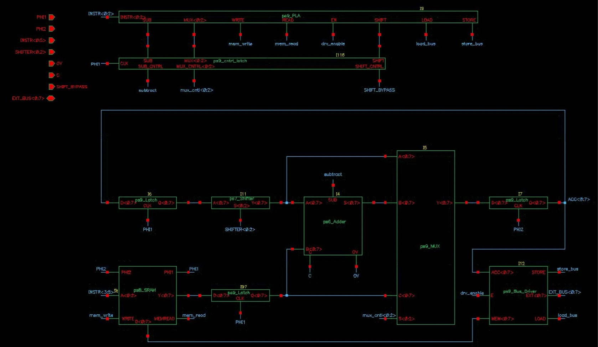<br>
<em>Fig. 1. Top-level microprocessor schematic.</em>
</div>

<div align="center">
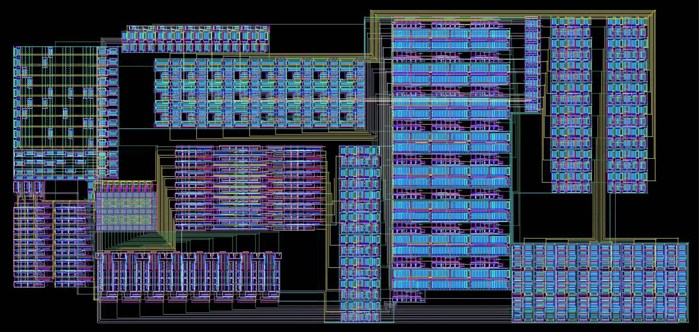<br>
<em>Fig. 2. Top-level microprocessor layout.</em>
</div>

<br>

During `LOAD`, the external bus writes data into SRAM. During `STORE`, the external bus receives data read from SRAM. Arithmetic operations use the accumulator and SRAM outputs as operands.

### B. Instruction Set and Control Table

Table 2 summarizes the instruction opcode and decoded control behavior.

| Instruction | Opcode | Function | `SUB` | `MUX2 (SRAM)` | `MUX1 (Adder)` | `MUX0 (Shifter)` | `MEM_WRITE` | `MEM_READ` | `DRV_EN` | `SHIFT_BYPASS` | `LOAD_BUS` | `STORE_BUS` |
| --- | --- | --- | ---: | ---: | ---: | ---: | ---: | ---: | ---: | ---: | ---: | ---: |
| `NOP` | `000` | No&nbsp;operation | - | 0 | 0 | 1 | 0 | - | 0 | 0 | 0 | 0 |
| `LOAD` | `001` | Mem[addr]&nbsp;&lt;-&nbsp;External&nbsp;Bus | - | - | - | - | 1 | - | 0 | - | 1 | 0 |
| `STORE` | `010` | External&nbsp;Bus&nbsp;&lt;-&nbsp;Mem[addr] | - | 1 | 0 | 0 | 0 | 1 | 0 | - | 0 | 1 |
| `GET` | `011` | Acc&nbsp;&lt;-&nbsp;Mem[addr] | - | 1 | 0 | 0 | 0 | 1 | 0 | - | 0 | 0 |
| `PUT` | `100` | Mem[addr]&nbsp;&lt;-&nbsp;Acc | - | - | - | - | 1 | - | 1 | - | 0 | 0 |
| `ADD` | `101` | Acc&nbsp;&lt;-&nbsp;Acc&nbsp;+&nbsp;Mem[addr] | 0 | 0 | 1 | 0 | 0 | 1 | 0 | 0 | 0 | 0 |
| `SUB` | `110` | Acc&nbsp;&lt;-&nbsp;Acc&nbsp;-&nbsp;Mem[addr] | 1 | 0 | 1 | 0 | 0 | 1 | 0 | 0 | 0 | 0 |
| `SHIFT` | `111` | Shift&nbsp;accumulator&nbsp;left&nbsp;by&nbsp;`SHIFT<2:0>` | - | 0 | 0 | 1 | 0 | - | 0 | 1 | 0 | 0 |

<div align="center"><strong>Table 2. Instruction Set and Control Signals</strong></div>

<br>

## III. Physical Verification

The completed top-level layout passes both DRC and LVS. The DRC result reports no rule violations, and the LVS result confirms a successful comparison between the extracted layout and schematic netlists. The final layout database is included in `Layout_files/ps9_Microprocessor.gds`.

<table>
<tr>
<td align="center">
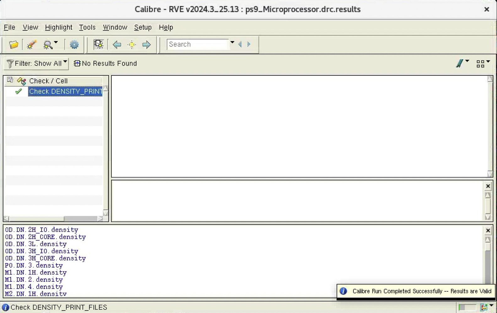<br>
<em>Fig. 3. DRC verification result.</em>
</td>
<td align="center">
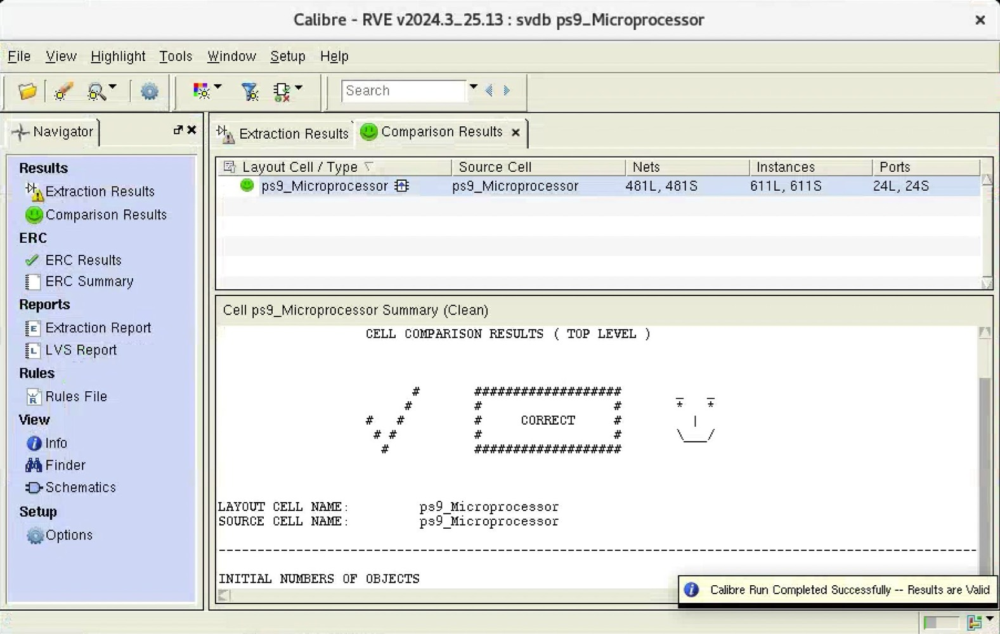<br>
<em>Fig. 4. LVS verification result.</em>
</td>
</tr>
</table>

<br>

## IV. Implementation

### A. Instruction-Decoder PLA

The instruction-decoder PLA is generated from the control behavior summarized in Table 2. The control table was translated into the Espresso input file `Espresso_files/instr_decoder.pla`, which defines three opcode inputs, `instr2`, `instr1`, and `instr0`, and ten decoded control outputs: `subtract`, `mux2`, `mux1`, `mux0`, `mem_write`, `mem_read`, `drv_enable`, `shift_bypass`, `load_bus`, and `store_bus`. Unused control values are marked as don't-care terms so Espresso can minimize the logic without forcing every output to a fixed value.

<div align="center">
<br>
<em>Fig. 5. Instruction-decoder PLA input file.</em>
</div>

<br>

The input PLA file was then processed with Espresso to generate the minimized output file, `Espresso_files/instr_decoder_out.pla`. Espresso preserves the same input and output interface while replacing selected opcode-specific rows with shared implicants, such as `-00`, `0-1`, `-01`, and `1-0`. These minimized product terms reduce the amount of logic required by the instruction decoder.

<div align="center">
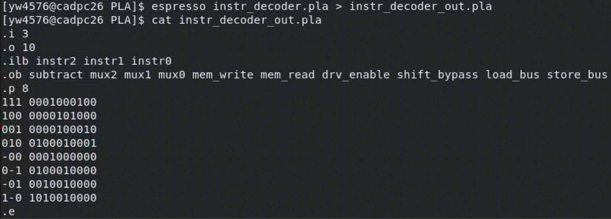<br>
<em>Fig. 6. Espresso-minimized instruction-decoder PLA output file.</em>
</div>

<br>

The Espresso-minimized output was used to build the instruction-decoder PLA symbol, schematic, and layout. The symbol provides the block-level interface, the schematic maps the minimized product terms to the decoded control outputs, and the final layout implements the same logic in a regular row-and-column PLA structure.

<div align="center">
<br>
<em>Fig. 7. Instruction-decoder PLA symbol.</em>
</div>

<div align="center">
<br>
<em>Fig. 8. Instruction-decoder PLA schematic.</em>
</div>

| Cell | Device | Length | Width | Fingers |
| --- | --- | ---: | ---: | ---: |
| PLA AND plane | PMOS | 60 nm | 1 um | 1 |
|  | NMOS | 60 nm | 1 um | 1 |
| PLA OR plane | PMOS | 60 nm | 1 um | 1 |
|  | NMOS | 60 nm | 1 um | 1 |
| PLA inverter | PMOS | 60 nm | 1 um | 2 |
|  | NMOS | 60 nm | 1 um | 1 |

<div align="center"><strong>Table 3. Instruction-Decoder PLA Cell Sizing</strong></div>

<br>

<div align="center">
<br>
<em>Fig. 9. Instruction-decoder PLA layout.</em>
</div>

<br>

### B. Control-Signal Latch

The control-signal latch stores selected PLA outputs so the datapath control signals remain stable during evaluation. The block latches the control bits used for subtraction, multiplexer selection, and shift control, then presents those stored signals to the datapath during the active clock phase. Fig. 10 shows the block-level symbol, and Fig. 11 and Fig. 12 show the schematic and layout implementation.

<div align="center">
<br>
<em>Fig. 10. Control-signal latch symbol.</em>
</div>

<div align="center">
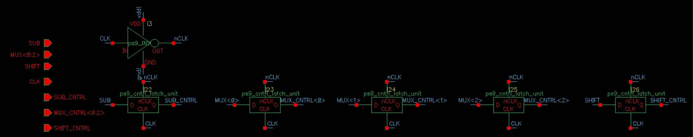<br>
<em>Fig. 11. Control-signal latch schematic.</em>
</div>

<div align="center">
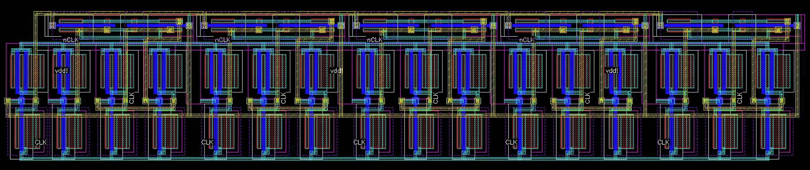<br>
<em>Fig. 12. Control-signal latch layout.</em>
</div>

<br>

The control-signal latch is built from one inverter cell and five latch cells. The inverter generates the complementary clock phase required by the latch stages, while each latch cell stores one decoded control bit from the PLA. The inverter uses a 2x PMOS finger count to balance the stronger NMOS pull-down path. The latch switch devices use matched 700 nm PMOS and NMOS widths so the pass path remains compact while providing balanced switching behavior. Fig. 13 and Fig. 14 show the reusable inverter and latch cells, and Table 4 lists the device sizes.

<div align="center">
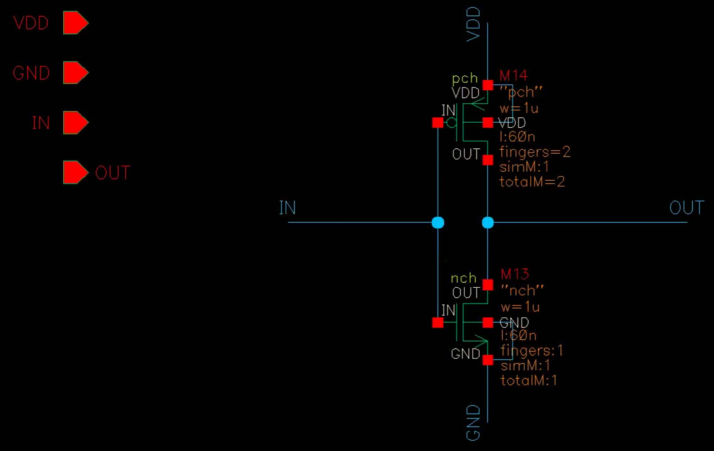<br>
<em>Fig. 13. Control-signal latch inverter schematic.</em>
</div>

<div align="center">
<br>
<em>Fig. 14. Control-signal latch cell schematic.</em>
</div>

| Cell | Device | Length | Width | Fingers |
| --- | --- | ---: | ---: | ---: |
| Control-latch inverter | PMOS | 60 nm | 1 um | 2 |
|  | NMOS | 60 nm | 1 um | 1 |
| Control-latch switch | PMOS | 60 nm | 700 nm | 1 |
|  | NMOS | 60 nm | 700 nm | 1 |

<div align="center"><strong>Table 4. Control-Signal Latch Cell Sizing</strong></div>

<br>

### C. SRAM Memory Design

The SRAM memory subsystem stores eight 8-bit words and provides the processor's data-memory interface. The block uses `PHI1`, `PHI2`, `MEM_READ`, `MEM_WRITE`, an 8-bit bidirectional data bus, and a 3-bit address input. It is organized into the top-level SRAM interface, the 8-by-8 core array, the row decoder, the `PHI2` precharge circuitry, the `PHI1`-qualified write circuitry, and the `MEM_READ`-controlled read path.

<div align="center">
<br>
<em>Fig. 15. SRAM symbol.</em>
</div>

<div align="center">
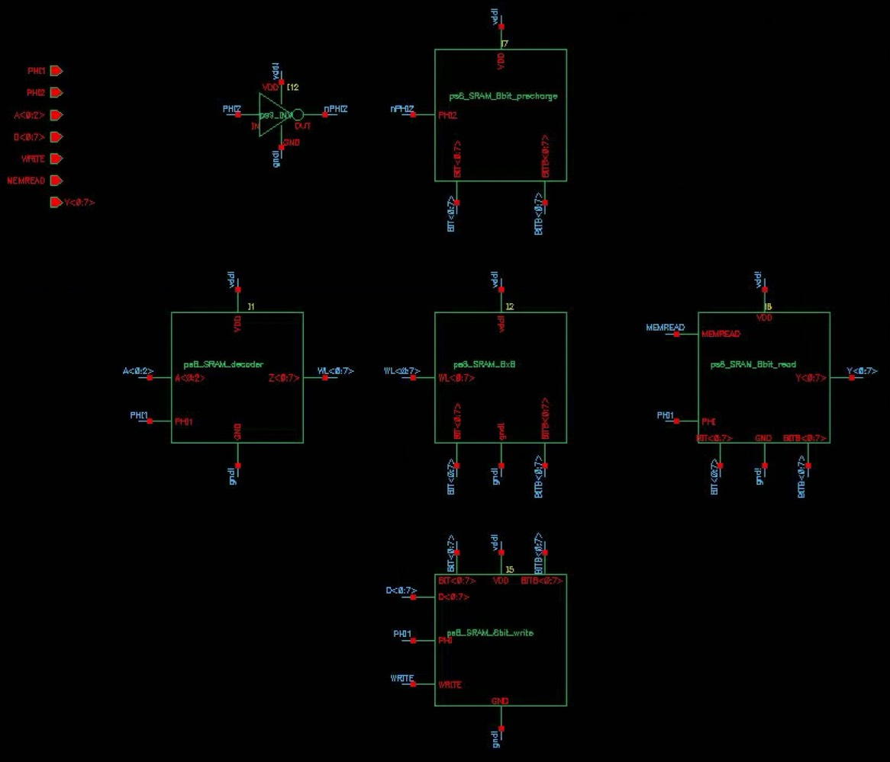<br>
<em>Fig. 16. SRAM schematic.</em>
</div>

<div align="center">
<br>
<em>Fig. 17. SRAM layout.</em>
</div>

<br>

#### SRAM Core Array

The SRAM core implements the required eight-word by eight-bit storage array. It is based on the TSMC SRAM layout from `arrayLib`, with the provided 8-by-4 array expanded to an 8-by-8 organization by adding SRAM column instances and extending the edge, corner, and well-strap structures. Fig. 18 and Fig. 19 show the core schematic and layout before the array is connected to the row decoder, precharge network, write circuitry, and read circuitry.

<table>
<tr>
<td align="center">
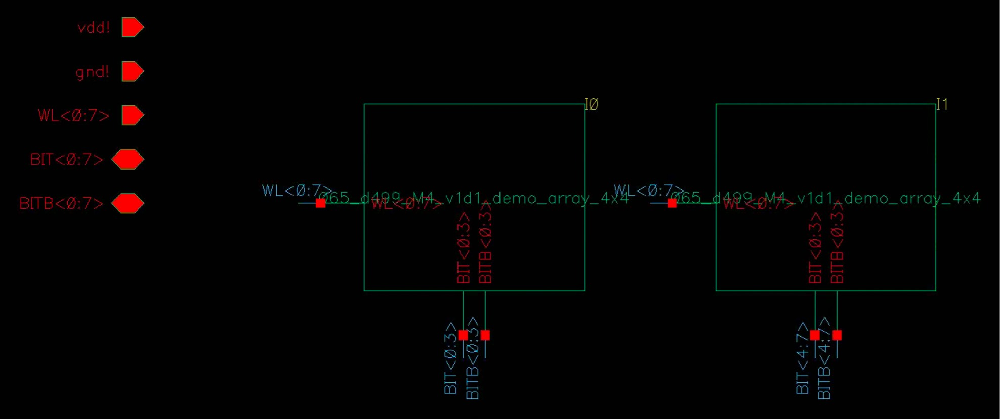<br>
<em>Fig. 18. SRAM core-array schematic.</em>
</td>
<td align="center">
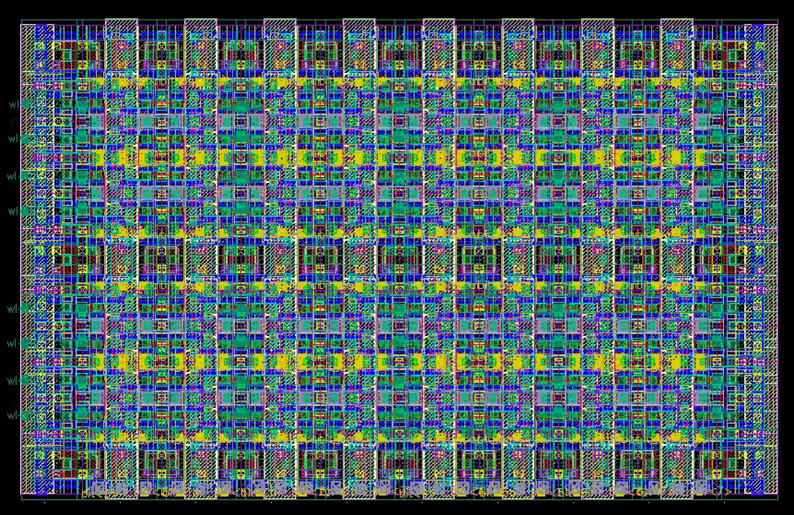<br>
<em>Fig. 19. SRAM core-array layout.</em>
</td>
</tr>
</table>

<br>

#### Row Decoder

The row decoder converts the 3-bit SRAM address field, `INSTR<5:3>`, into eight row-select outputs, with only one SRAM row selected at a time. The inverters generate the complemented address bits required for decoding. First-stage three-input AND cells form the decoded row terms from the true and complemented address bits, and second-stage three-input AND cells qualify those row terms with `PHI1`. This structure enables the selected word line only during the active `PHI1` interval and keeps the decoder outputs disabled otherwise. Fig. 20 and Fig. 21 show the row-decoder schematic and layout.

<table>
<tr>
<td align="center">
<br>
<em>Fig. 20. SRAM row-decoder schematic.</em>
</td>
<td align="center">
<br>
<em>Fig. 21. SRAM row-decoder layout.</em>
</td>
</tr>
</table>

The decoder is implemented with three inverter cells and sixteen three-input AND cells. Each AND cell is built from a three-input NAND followed by an output inverter. The inverter uses a 2x PMOS finger count to balance the stronger NMOS pull-down path, and the NAND stage uses 3x NMOS fingers to compensate for the three-device series stack. Fig. 22 and Fig. 23 show these reusable decoder cells.

<div align="center">
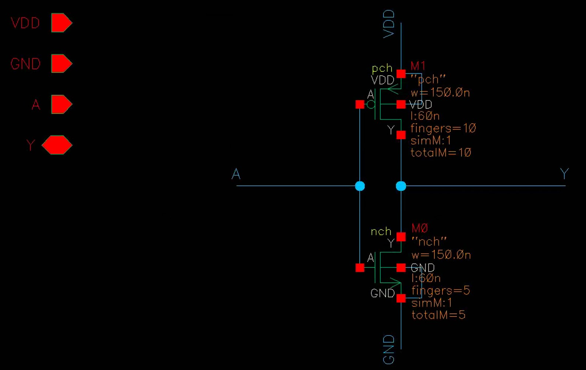<br>
<em>Fig. 22. SRAM row-decoder inverter schematic.</em>
</div>

<div align="center">
<br>
<em>Fig. 23. SRAM row-decoder three-input AND schematic.</em>
</div>

| Cell | Device | Length | Width | Fingers |
| --- | --- | ---: | ---: | ---: |
| Row-decoder inverter | PMOS | 60 nm | 150 nm | 10 |
|  | NMOS | 60 nm | 150 nm | 5 |
| Row-decoder three-input AND | PMOS | 60 nm | 150 nm | 2 |
|  | NMOS | 60 nm | 150 nm | 3 |

<div align="center"><strong>Table 5. SRAM Row-Decoder Cell Sizing</strong></div>

<br>

#### Precharge Circuits

The precharge circuit initializes the SRAM bitlines before row evaluation. During `PHI2`, the precharge devices pull both the bitline and bitline-bar nodes high so the selected cell can disturb the differential pair during the following `PHI1` interval. Fig. 24 and Fig. 25 show the full precharge schematic and layout.

<div align="center">
<br>
<em>Fig. 24. SRAM precharge circuit schematic.</em>
</div>

<div align="center">
<br>
<em>Fig. 25. SRAM precharge circuit layout.</em>
</div>

The one-bit precharge cell is the repeated column cell used for each SRAM bit. It uses two matched PMOS devices, one connected to the bitline and one connected to the bitline-bar node. Both devices use a 60 nm channel length, 300 nm width, and one finger so the complementary bitlines receive balanced pull-up strength during `PHI2`. Fig. 26 shows the one-bit precharge schematic, and Table 6 lists the device sizes.

<div align="center">
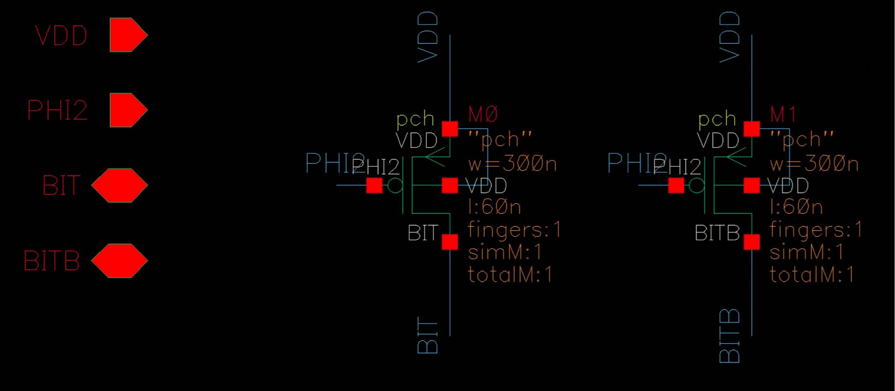<br>
<em>Fig. 26. One-bit SRAM precharge schematic.</em>
</div>

| Cell | Device | Length | Width | Fingers |
| --- | --- | ---: | ---: | ---: |
| Precharge cell | Bitline PMOS | 60 nm | 300 nm | 1 |
|  | Bitline-bar PMOS | 60 nm | 300 nm | 1 |

<div align="center"><strong>Table 6. SRAM Precharge Cell Sizing</strong></div>

<br>

#### Write Circuits

The write circuit drives data onto the selected SRAM column during memory write operations. The write path is qualified by `PHI1`, so the bitline drivers are active only during the evaluation phase when a selected word line is enabled. Fig. 27 and Fig. 28 show the full write schematic and layout.

<div align="center">
<br>
<em>Fig. 27. SRAM write circuit schematic.</em>
</div>

<div align="center">
<br>
<em>Fig. 28. SRAM write circuit layout.</em>
</div>

The one-bit write cell is the repeated driver used for each data bit. It receives the write data and its complement, then drives the bitline pair only when the write control path is enabled. This keeps unselected columns isolated and allows the same cell structure to be tiled across the 8-bit data path. Fig. 29 shows the one-bit write schematic, and Table 7 references the corresponding device sizing.

<div align="center">
<br>
<em>Fig. 29. One-bit SRAM write schematic.</em>
</div>

| Cell | Device | Length | Width | Fingers |
| --- | --- | ---: | ---: | ---: |
| Write cell | Write-driver devices | See Fig. 29 | See Fig. 29 | See Fig. 29 |

<div align="center"><strong>Table 7. SRAM Write Cell Sizing</strong></div>

<br>

#### Read Circuits

The read circuit transfers the selected SRAM column value onto the internal data path during memory-read operations. The read driver is controlled by `MEM_READ`, which keeps the output path disabled when the memory is not being read. Fig. 30 and Fig. 31 show the complete read schematic and layout.

<div align="center">
<br>
<em>Fig. 30. SRAM read circuit schematic.</em>
</div>

<div align="center">
<br>
<em>Fig. 31. SRAM read circuit layout.</em>
</div>

The one-bit read cell is the repeated read path used for each SRAM data bit. It receives the selected bitline information and drives the output only when `MEM_READ` is asserted, preventing bus contention during non-read cycles. Fig. 32 shows the one-bit read schematic, and Table 8 references the corresponding device sizing.

<div align="center">
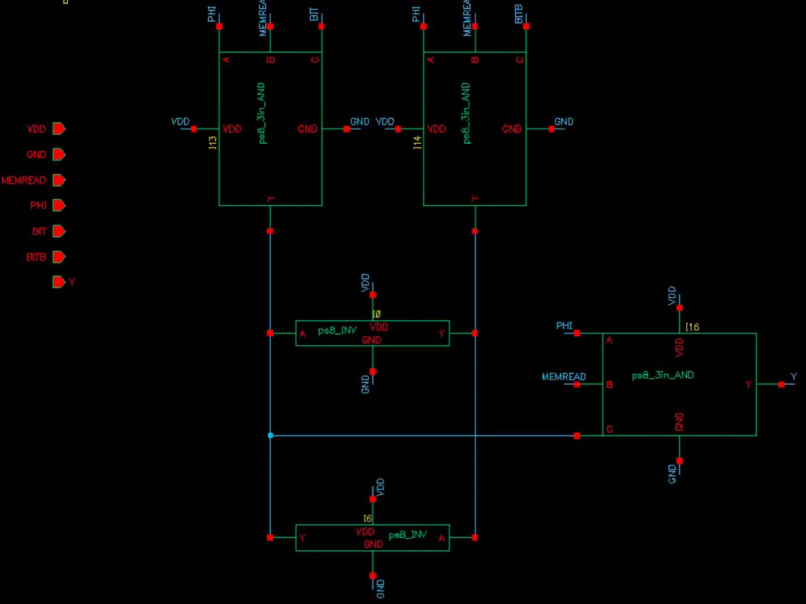<br>
<em>Fig. 32. One-bit SRAM read schematic.</em>
</div>

| Cell | Device | Length | Width | Fingers |
| --- | --- | ---: | ---: | ---: |
| Read cell | Read-driver devices | See Fig. 32 | See Fig. 32 | See Fig. 32 |

<div align="center"><strong>Table 8. SRAM Read Cell Sizing</strong></div>

<br>

### D. Adder/Subtractor

The adder/subtractor performs 8-bit addition and subtraction for the accumulator datapath and generates the carry and overflow flags. The symbol defines the arithmetic block interface, the schematic connects the repeated one-bit adder stages, and the layout implements the full arithmetic datapath. Fig. 33, Fig. 34, and Fig. 35 show the adder/subtractor symbol, schematic, and layout.

<div align="center">
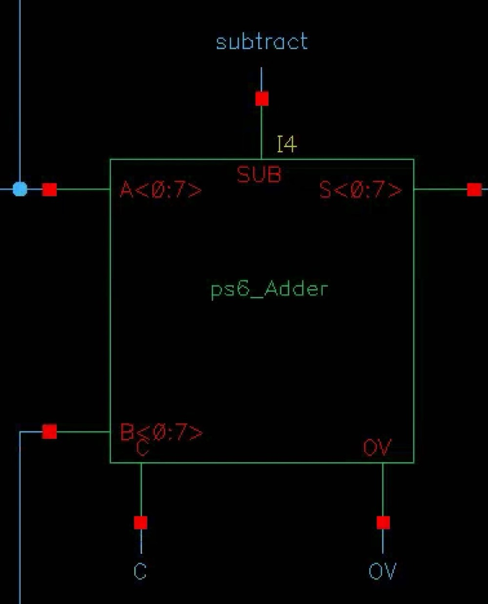<br>
<em>Fig. 33. Adder/subtractor symbol.</em>
</div>

<div align="center">
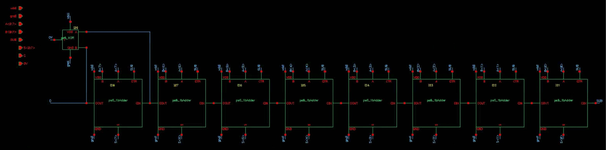<br>
<em>Fig. 34. Adder/subtractor schematic.</em>
</div>

<div align="center">
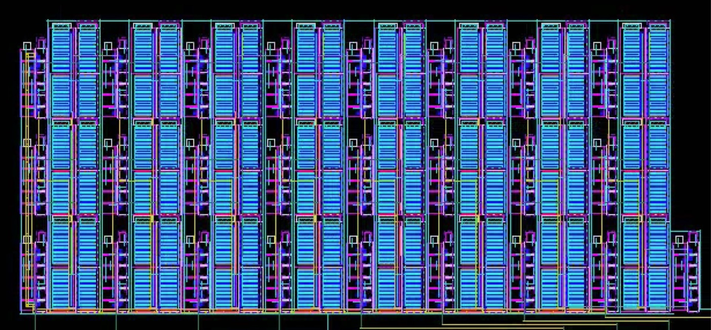<br>
<em>Fig. 35. Adder/subtractor layout.</em>
</div>

The adder/subtractor is built from repeated one-bit adder cells. The full-adder cell provides the bit-slice sum and carry behavior, while the XOR and NAND cells implement supporting arithmetic logic for addition and subtraction. Fig. 36 through Fig. 39 show the reusable adder cells, and Table 9 references the corresponding cell-sizing information.

<table>
<tr>
<td align="center">
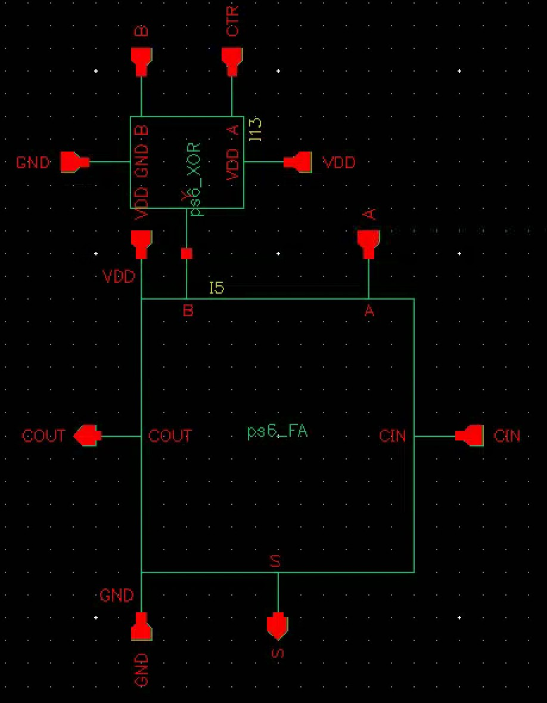<br>
<em>Fig. 36. One-bit adder schematic.</em>
</td>
<td align="center">
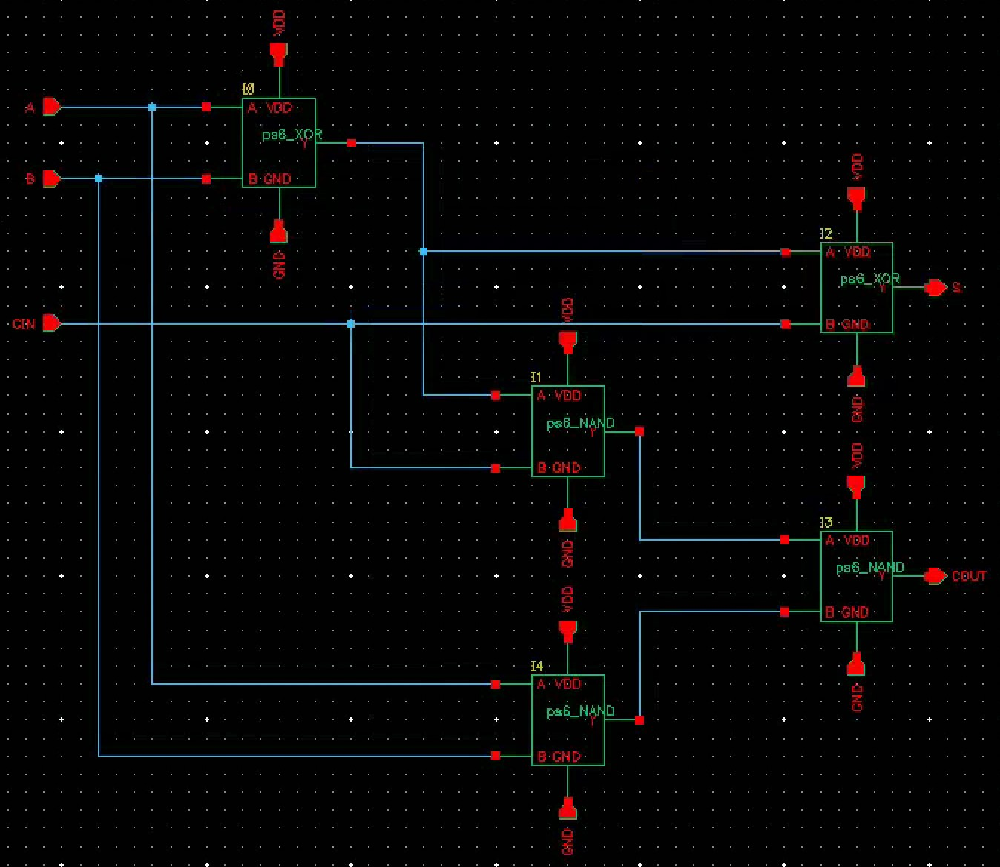<br>
<em>Fig. 37. Full-adder cell schematic.</em>
</td>
</tr>
</table>

<div align="center">
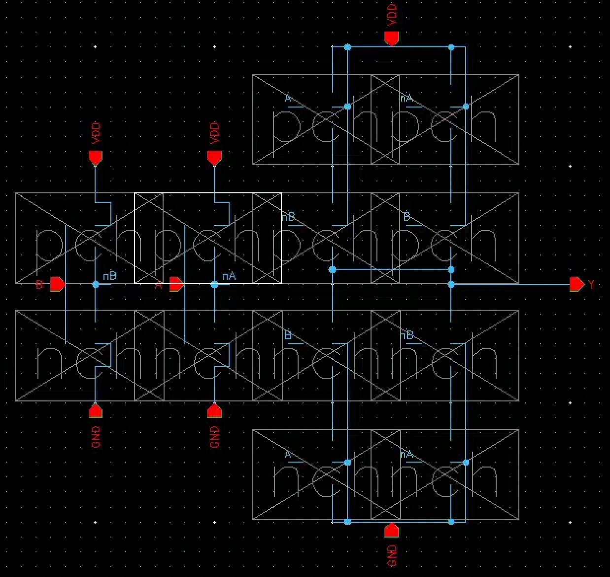<br>
<em>Fig. 38. Adder XOR cell schematic.</em>
</div>

<div align="center">
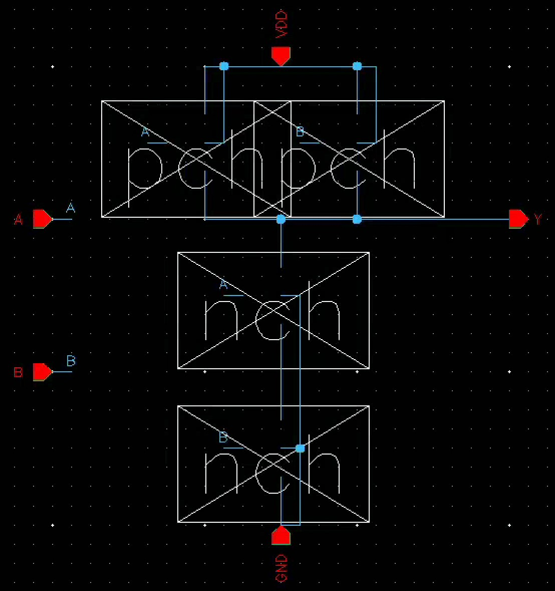<br>
<em>Fig. 39. Adder NAND cell schematic.</em>
</div>

| Cell | Device | Length | Width | Fingers |
| --- | --- | ---: | ---: | ---: |
| One-bit adder | Adder devices | See Fig. 36 | See Fig. 36 | See Fig. 36 |
| Full-adder cell | Full-adder devices | See Fig. 37 | See Fig. 37 | See Fig. 37 |
| XOR cell | XOR devices | See Fig. 38 | See Fig. 38 | See Fig. 38 |
| NAND cell | NAND devices | See Fig. 39 | See Fig. 39 | See Fig. 39 |

<div align="center"><strong>Table 9. Adder/Subtractor Cell Sizing</strong></div>

<br>

### E. Shifter

The shifter implements the accumulator shift operation and supports the shift-bypass control path. The symbol defines the shifter interface, the schematic connects the repeated shift-selection cells, and the layout tiles those cells into the full 8-bit shifter. Fig. 40, Fig. 41, and Fig. 42 show the shifter symbol, schematic, and layout.

<div align="center">
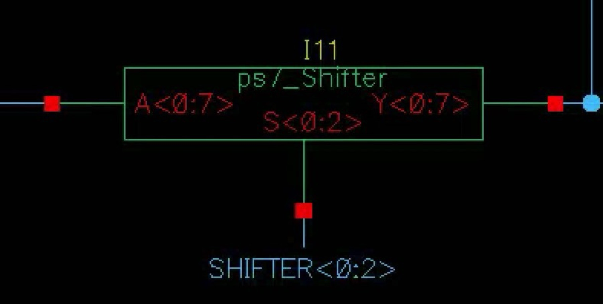<br>
<em>Fig. 40. Shifter symbol.</em>
</div>

<div align="center">
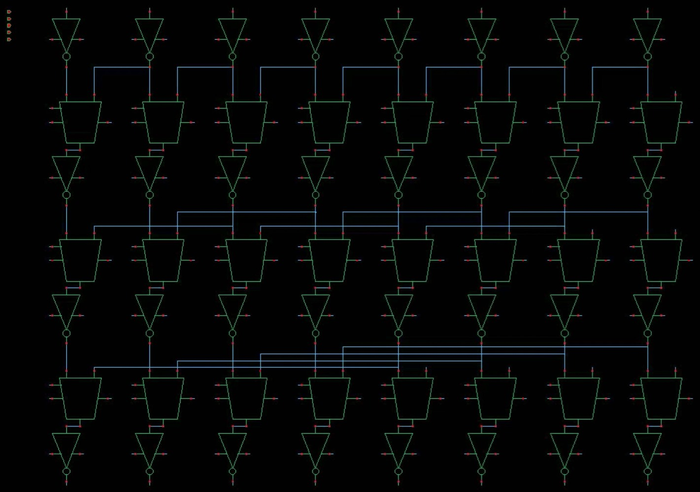<br>
<em>Fig. 41. Shifter schematic.</em>
</div>

<div align="center">
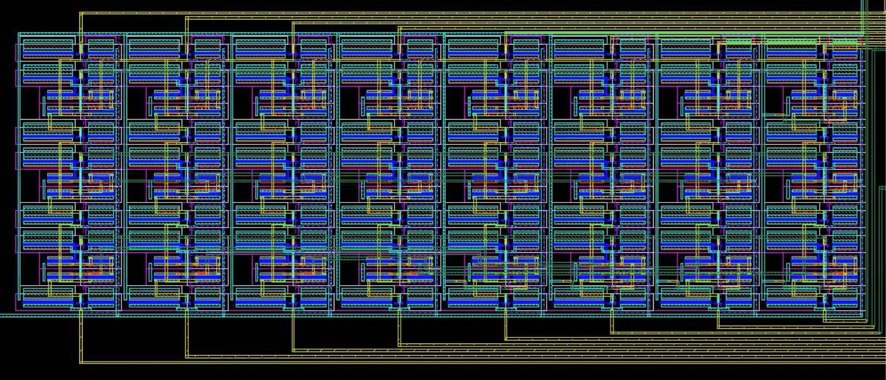<br>
<em>Fig. 42. Shifter layout.</em>
</div>

The shifter uses reusable inverter and multiplexer cells. The inverter generates complementary control and data signals where needed, and the multiplexer cell selects between shifted and bypassed data paths. Fig. 43 and Fig. 44 show these cell schematics, and Table 10 references the corresponding cell-sizing information.

<div align="center">
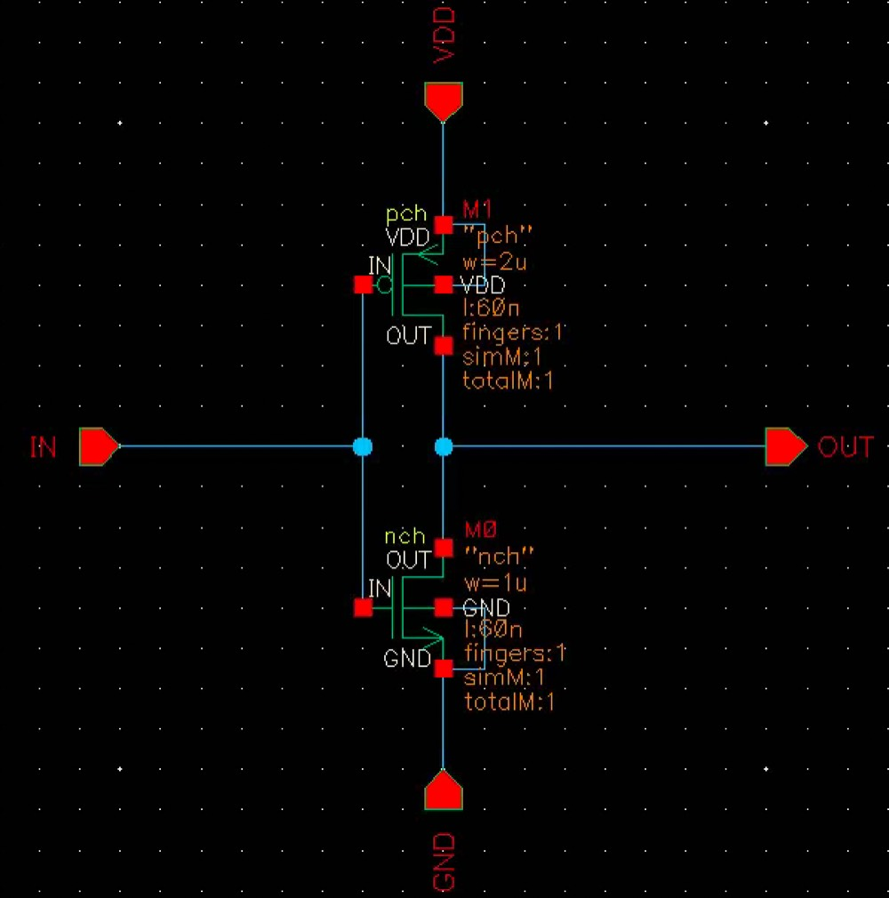<br>
<em>Fig. 43. Shifter inverter cell schematic.</em>
</div>

<div align="center">
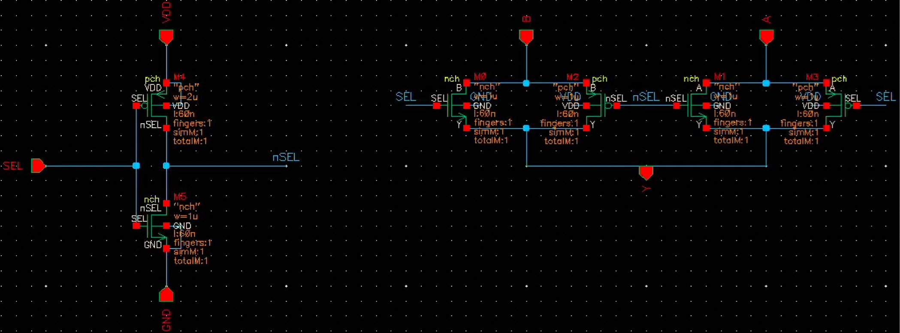<br>
<em>Fig. 44. Shifter multiplexer cell schematic.</em>
</div>

| Cell | Device | Length | Width | Fingers |
| --- | --- | ---: | ---: | ---: |
| Shifter inverter | Inverter devices | See Fig. 43 | See Fig. 43 | See Fig. 43 |
| Shifter multiplexer | Multiplexer devices | See Fig. 44 | See Fig. 44 | See Fig. 44 |

<div align="center"><strong>Table 10. Shifter Cell Sizing</strong></div>

<br>

### F. Multiplexer

The multiplexer selects the value written into the accumulator from the SRAM, adder/subtractor, and shifter paths. The symbol defines the select and data interface, the schematic connects the full 8-bit multiplexer, and the layout places the repeated cells in a compact datapath row. Fig. 45, Fig. 46, and Fig. 47 show the multiplexer symbol, schematic, and layout.

<table>
<tr>
<td align="center">
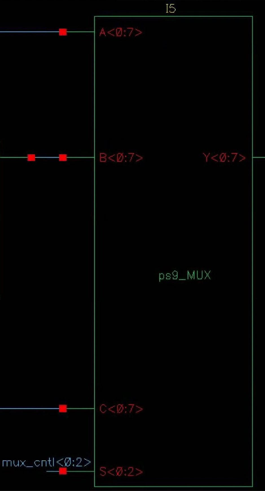<br>
<em>Fig. 45. Multiplexer symbol.</em>
</td>
<td align="center">
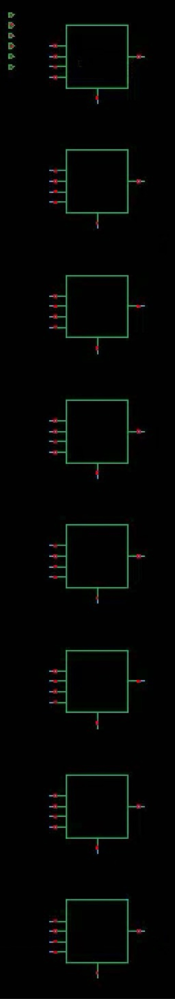<br>
<em>Fig. 46. Multiplexer schematic.</em>
</td>
<td align="center">
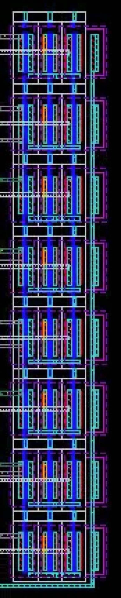<br>
<em>Fig. 47. Multiplexer layout.</em>
</td>
</tr>
</table>

The multiplexer is built from a repeated one-bit selection cell. Each one-bit cell selects the corresponding datapath bit under the decoded control signals, and repeating the cell keeps the 8-bit schematic and layout regular. Fig. 48 shows the one-bit multiplexer schematic, and Table 11 references the corresponding device sizing.

<div align="center">
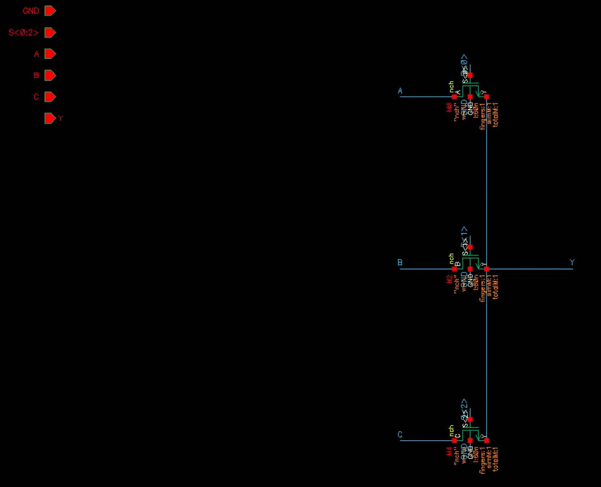<br>
<em>Fig. 48. One-bit multiplexer schematic.</em>
</div>

| Cell | Device | Length | Width | Fingers |
| --- | --- | ---: | ---: | ---: |
| One-bit multiplexer | Multiplexer devices | See Fig. 48 | See Fig. 48 | See Fig. 48 |

<div align="center"><strong>Table 11. Multiplexer Cell Sizing</strong></div>

<br>

### G. Accumulator Latch

The accumulator latch stores the selected 8-bit datapath result for the next operation. The symbol defines the accumulator interface, the schematic connects the repeated storage cells, and the layout implements the same repeated storage structure physically. Fig. 49, Fig. 50, and Fig. 51 show the accumulator latch symbol, schematic, and layout.

<div align="center">
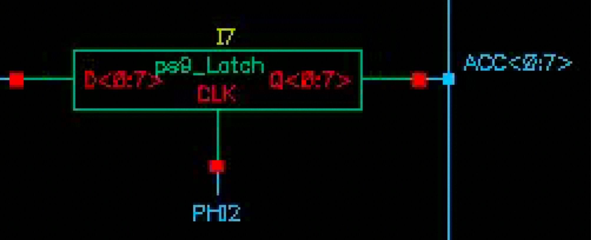<br>
<em>Fig. 49. Accumulator latch symbol.</em>
</div>

<table>
<tr>
<td align="center">
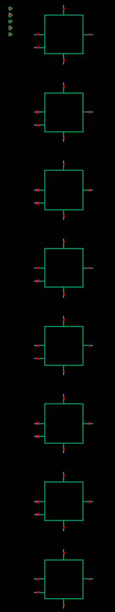<br>
<em>Fig. 50. Accumulator latch schematic.</em>
</td>
<td align="center">
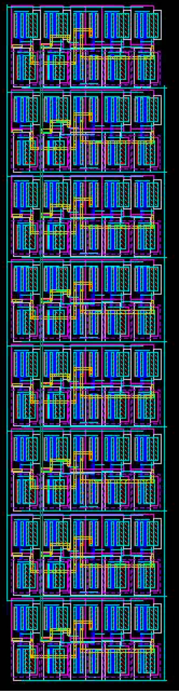<br>
<em>Fig. 51. Accumulator latch layout.</em>
</td>
</tr>
</table>

The accumulator latch uses a repeated one-bit latch cell. Each cell stores one datapath bit and is tiled across the accumulator so the schematic-to-layout correspondence remains clear. Fig. 52 shows the one-bit accumulator latch schematic, and Table 12 references the corresponding device sizing.

<div align="center">
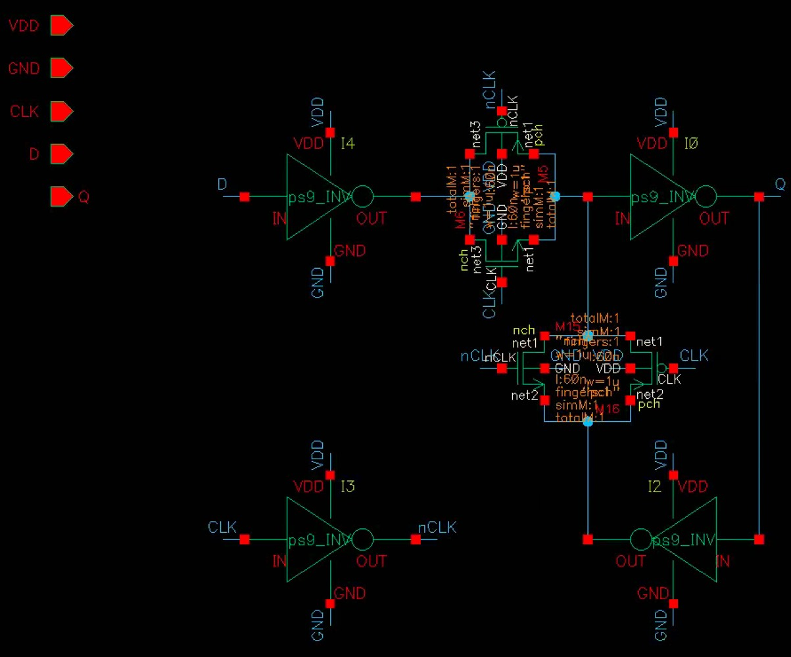<br>
<em>Fig. 52. One-bit accumulator latch schematic.</em>
</div>

| Cell | Device | Length | Width | Fingers |
| --- | --- | ---: | ---: | ---: |
| One-bit accumulator latch | Latch devices | See Fig. 52 | See Fig. 52 | See Fig. 52 |

<div align="center"><strong>Table 12. Accumulator Latch Cell Sizing</strong></div>

<br>

### H. External Bus Driver

The external bus driver connects the internal datapath to `EXT_BUS<0:7>` during store operations. The symbol defines the bus-driver interface, the schematic connects the repeated output-driver cells, and the layout implements the 8-bit bus driver physically. Fig. 53, Fig. 54, and Fig. 55 show the external bus-driver symbol, schematic, and layout.

<div align="center">
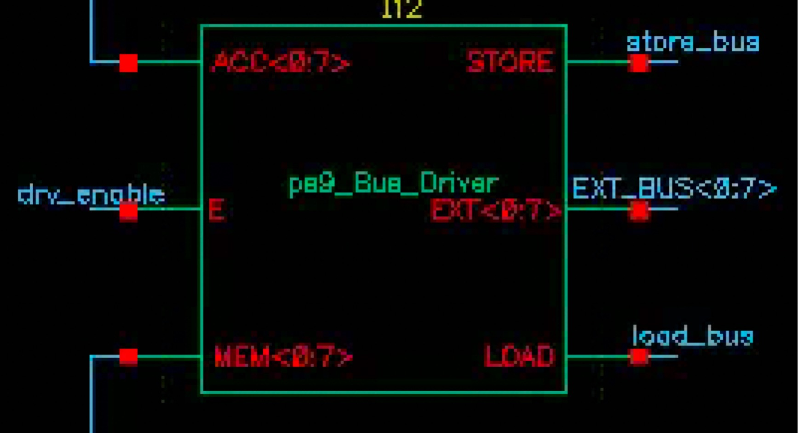<br>
<em>Fig. 53. External bus-driver symbol.</em>
</div>

<table>
<tr>
<td align="center">
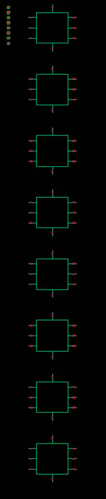<br>
<em>Fig. 54. External bus-driver schematic.</em>
</td>
<td align="center">
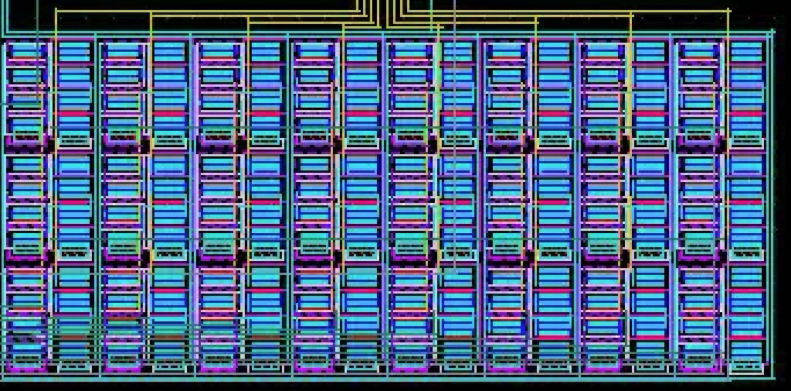<br>
<em>Fig. 55. External bus-driver layout.</em>
</td>
</tr>
</table>

The external bus driver uses a tristate output cell and a repeated one-bit bus-driver cell. The tristate cell isolates the external bus when `STORE_BUS` is inactive, while the one-bit driver cell is repeated across all eight bus lines. Fig. 56 and Fig. 57 show the reusable bus-driver cells, and Table 13 references the corresponding cell-sizing information.

<div align="center">
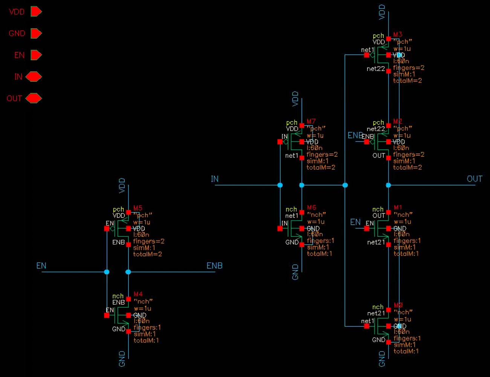<br>
<em>Fig. 56. Tristate bus-driver schematic.</em>
</div>

<div align="center">
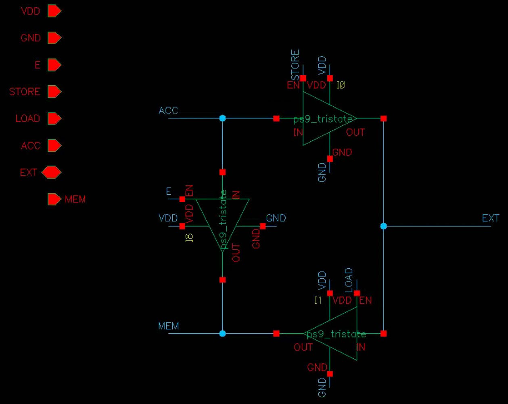<br>
<em>Fig. 57. One-bit bus-driver schematic.</em>
</div>

| Cell | Device | Length | Width | Fingers |
| --- | --- | ---: | ---: | ---: |
| Tristate bus driver | Tristate devices | See Fig. 56 | See Fig. 56 | See Fig. 56 |
| One-bit bus driver | Driver devices | See Fig. 57 | See Fig. 57 | See Fig. 57 |

<div align="center"><strong>Table 13. External Bus-Driver Cell Sizing</strong></div>

<br>

## V. Functional Verification

### A. Test Operation Table

The transient test sequence in Table 14 verifies the processor at the instruction level. The opcode field is applied to `INSTR<2:0>`, and the SRAM address field is applied to `INSTR<5:3>`. Each instruction is evaluated over one clock period of 1 ns.

Steps 1-8 load the initial SRAM contents through the external bus. Steps 9-32 exercise internal processor operations by repeating a `NOP`, `GET`, arithmetic or shift operation, and `PUT` sequence on selected SRAM addresses. The ADD and SUB steps record the expected carry and overflow outputs, while the SHIFT steps record the applied `SHIFT<2:0>` control code. Steps 33-40 store the final SRAM contents onto the external bus so the memory results can be checked against the expected binary and decimal values.

| Step | Operation | Opcode<br>`INSTR<2:0>`<br>`[input]` | SRAM&nbsp;Address | Memcode<br>`INSTR<5:3>`<br>`[input]` | SRAM&nbsp;Data&nbsp;(Binary)<br>`[input/output]` | SRAM&nbsp;Data&nbsp;(Decimal)<br>`[input/output]` | Carry<br>`C`<br>`[output]` | Overflow<br>`OV`<br>`[output]` | Shift&nbsp;Code<br>`SHIFT<2:0>`<br>`[input]` |
| ---: | --- | --- | ---: | --- | --- | ---: | ---: | ---: | --- |
| 1 | `LOAD` | `001` | 0 | `000` | `00000000` | 0 |  |  |  |
| 2 | `LOAD` | `001` | 1 | `001` | `01001001` | 73 |  |  |  |
| 3 | `LOAD` | `001` | 2 | `010` | `10010010` | -110 |  |  |  |
| 4 | `LOAD` | `001` | 3 | `011` | `11011011` | -37 |  |  |  |
| 5 | `LOAD` | `001` | 4 | `100` | `00100100` | 36 |  |  |  |
| 6 | `LOAD` | `001` | 5 | `101` | `01101101` | 109 |  |  |  |
| 7 | `LOAD` | `001` | 6 | `110` | `10110110` | -74 |  |  |  |
| 8 | `LOAD` | `001` | 7 | `111` | `11111111` | -1 |  |  |  |
| 9 | `NOP` | `000` | 0 | `000` |  |  |  |  |  |
| 10 | `GET` | `011` | 3 | `011` | `11011011` | -37 |  |  |  |
| 11 | `ADD` | `101` | 4 | `100` | `00100100` | 36 | 0 | 0 |  |
| 12 | `PUT` | `100` | 0 | `000` | `11111111` | -1 |  |  |  |
| 13 | `NOP` | `000` | 0 | `000` |  |  |  |  |  |
| 14 | `GET` | `011` | 1 | `001` | `01001001` | 73 |  |  |  |
| 15 | `ADD` | `101` | 5 | `101` | `01101101` | 109 | 0 | 1 |  |
| 16 | `PUT` | `100` | 1 | `001` | `10110110` | -74 |  |  |  |
| 17 | `NOP` | `000` | 0 | `000` |  |  |  |  |  |
| 18 | `GET` | `011` | 5 | `101` | `01101101` | 109 |  |  |  |
| 19 | `SUB` | `110` | 4 | `100` | `00100100` | 36 | 1 | 0 |  |
| 20 | `PUT` | `100` | 2 | `010` | `01001001` | 73 |  |  |  |
| 21 | `NOP` | `000` | 0 | `000` |  |  |  |  |  |
| 22 | `GET` | `011` | 3 | `011` | `11011011` | -37 |  |  |  |
| 23 | `SUB` | `110` | 5 | `101` | `01101101` | 109 | 1 | 1 |  |
| 24 | `PUT` | `100` | 3 | `011` | `01101110` | 110 |  |  |  |
| 25 | `NOP` | `000` | 0 | `000` |  |  |  |  |  |
| 26 | `GET` | `011` | 0 | `000` | `11111111` | -1 |  |  |  |
| 27 | `SHIFT` | `111` | 0 | `000` |  |  |  |  | `011` |
| 28 | `PUT` | `100` | 4 | `100` | `11111000` | -8 |  |  |  |
| 29 | `NOP` | `000` | 0 | `000` |  |  |  |  |  |
| 30 | `GET` | `011` | 3 | `011` | `01101110` | 110 |  |  |  |
| 31 | `SHIFT` | `111` | 0 | `000` |  |  |  |  | `101` |
| 32 | `PUT` | `100` | 5 | `101` | `11000000` | -64 |  |  |  |
| 33 | `STORE` | `010` | 0 | `000` | `11111111` | -1 |  |  |  |
| 34 | `STORE` | `010` | 1 | `001` | `10110110` | -74 |  |  |  |
| 35 | `STORE` | `010` | 2 | `010` | `01001001` | 73 |  |  |  |
| 36 | `STORE` | `010` | 3 | `011` | `01101110` | 110 |  |  |  |
| 37 | `STORE` | `010` | 4 | `100` | `11111000` | -8 |  |  |  |
| 38 | `STORE` | `010` | 5 | `101` | `11000000` | -64 |  |  |  |
| 39 | `STORE` | `010` | 6 | `110` | `10110110` | -74 |  |  |  |
| 40 | `STORE` | `010` | 7 | `111` | `11111111` | -1 |  |  |  |

<div align="center"><strong>Table 14. Functional Verification Test Sequence</strong></div>

<br>

### B. Simulation Testbench

The simulation testbench applies the two-phase clocks, instruction sequence, and external bus values used for functional verification. It connects the processor core to the stimulus sources and output probes used to confirm memory, arithmetic, shift, and bus-transfer behavior.

<div align="center">
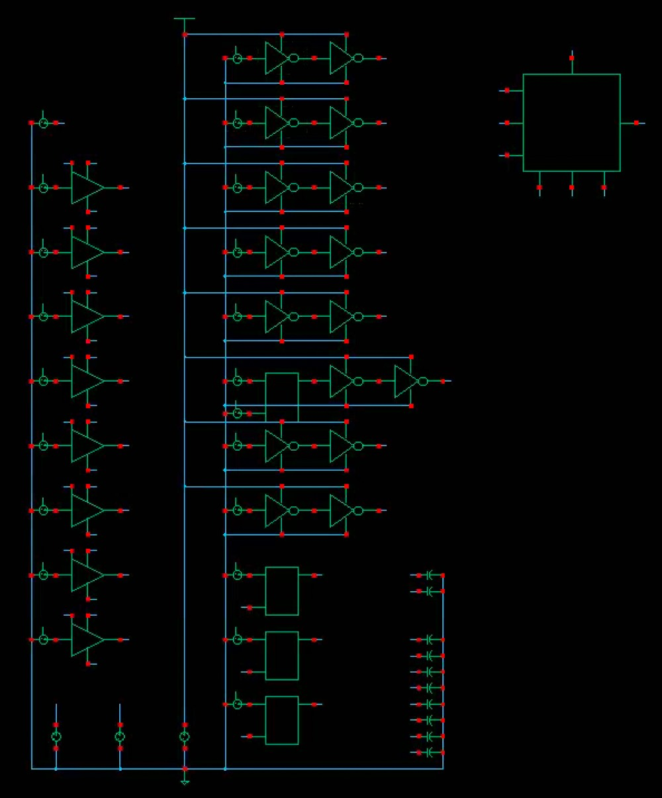<br>
<em>Fig. 58. Functional-verification testbench schematic.</em>
</div>

<br>

### C. Waveform Results

The clock and instruction waveform verifies that `PHI1`, `PHI2`, `INSTR<2:0>`, and `INSTR<5:3>` follow the sequence defined in Table 14. The clock runs at 1 GHz, so each instruction occupies one clock period of 1 ns. `INSTR<2:0>` carries the opcode from MSB to LSB, and `INSTR<5:3>` carries the SRAM address code from MSB to LSB. The waveform first shows the eight LOAD cycles, then the internal NOP/GET/arithmetic-or-shift/PUT groups, and finally the STORE cycles used to read out the final SRAM contents.

<div align="center">
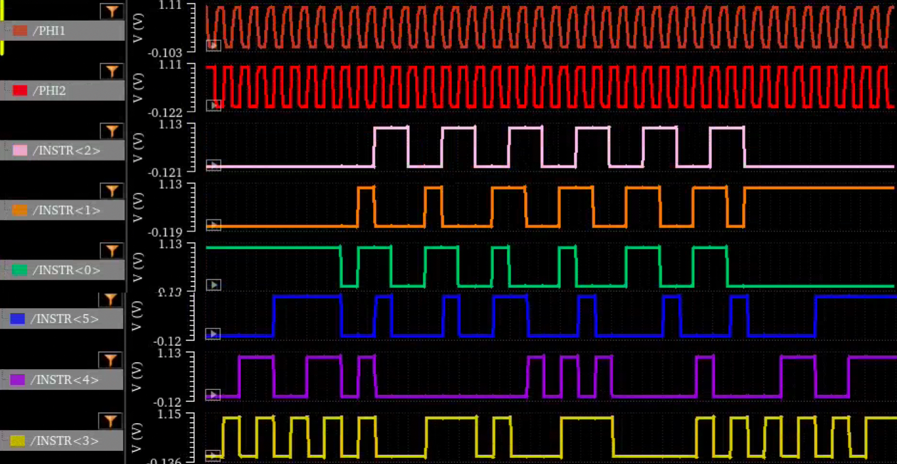<br>
<em>Fig. 59. Clock and instruction-code waveform.</em>
</div>

<br>

The external-bus waveform confirms the data movement listed in Table 14. From 0 ns to 8 ns, the external bus supplies the initial values during the LOAD operations. From 8 ns to 32 ns, the bus remains inactive while the processor performs internal SRAM, arithmetic, and shift operations. From 32 ns to 40 ns, the STORE operations drive the final SRAM values back onto the external bus.

The shifter-control and adder-output waveform verifies the control and status signals used in the internal operation window. `SHIFT_BYPASS` is asserted during SHIFT instructions, `SHIFT<2:0>` matches the shift codes listed in Table 14, and the carry and overflow outputs are checked during the ADD and SUB operations in steps 11, 15, 19, and 23.

<div align="center">
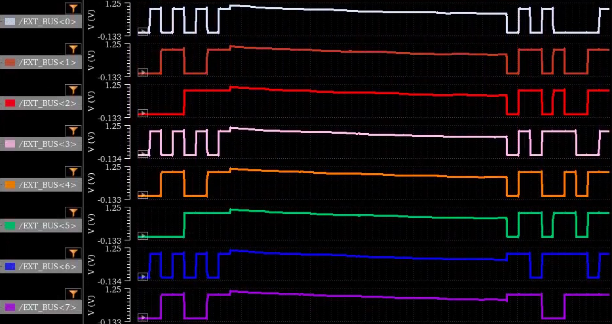<br>
<em>Fig. 60. External-bus input and output waveform.</em>
</div>

<div align="center">
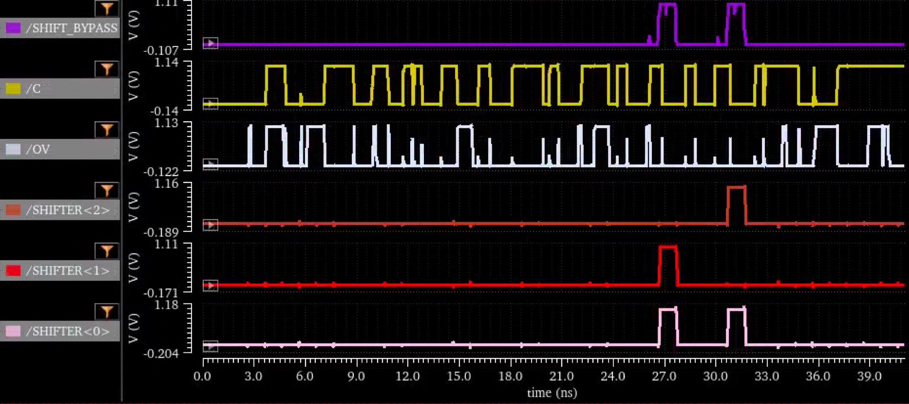<br>
<em>Fig. 61. Shifter-control and adder-output waveform.</em>
</div>

<br>

### D. Delay Measurement

The clock-to-Q delay waveform shows the measured output delay from the active clock edge to the external bus transition.

<div align="center">
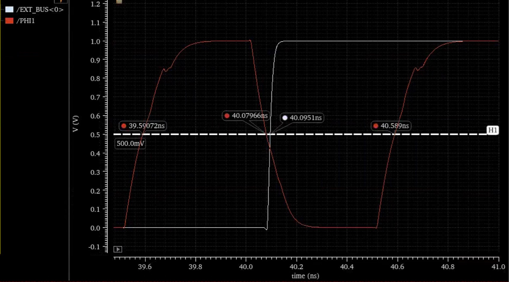<br>
<em>Fig. 62. Clock-to-Q delay waveform.</em>
</div>

<br>

A representative timing measurement compares `PHI1` and `EXT_BUS<0>` at the 500 mV crossing. Based on the plotted cursor values in Fig. 62, the output transition follows the clock transition by approximately 15.44 ps.

```text
PHI1 reference crossing ~= 40.07966 ns
EXT_BUS<0> crossing     ~= 40.0951 ns
Measured delay          ~= 15.44 ps
```

## VI. Design File Package

| File or Directory | Purpose |
| --- | --- |
| `EECS4321_Submission/eecs4321_submission.pdf` | Final submission report |
| `EECS4321_Submission/project_requirements.pdf` | Project requirements/reference PDF |
| `Layout_files/ps9_Microprocessor.gds` | Final microprocessor layout database |
| `figures/` | Schematic, layout, DRC/LVS, and waveform figures used by this report |
| `Project_Report.md` | DAC-style Markdown version of the microprocessor report |

<div align="center"><strong>Table 15. Design File Package</strong></div>

<br>

## VII. Conclusion

A full-custom 8-bit microprocessor core in 65 nm CMOS was implemented and verified at the layout level. The design integrates instruction decoding, control latching, SRAM, arithmetic, shifting, accumulator storage, and external bus transfer logic. The included schematic and layout figures document the completed design hierarchy and physical blocks, while the DRC and LVS captures confirm design-rule correctness and schematic-layout equivalence.

Functional transient simulation verifies the instruction sequence, memory loading, arithmetic operations, shift control, bus store behavior, carry and overflow outputs, and representative output timing.

## References

[1] Yi-Hsiang Wei and Zijian Shang, "Ps9 Microprocessor," project report PDF, 2025.
