# Full-Custom 8-Bit Microprocessor Core in 65 nm CMOS

Yi-Hsiang Wei and Zijian Shang  
Department of Electrical Engineering, Columbia University  
VLSI Design Project

## Abstract

This report presents the layout, physical verification, and waveform-level functional verification of a full-custom 8-bit microprocessor core in 65 nm CMOS. The processor integrates a PLA-based instruction decoder, a control-signal latch, an 8-by-8 SRAM, an arithmetic datapath, a shifter, an accumulator latch, a multiplexer, and a bidirectional external bus interface.

The instruction set supports eight operations: `NOP`, `LOAD`, `STORE`, `GET`, `PUT`, `ADD`, `SUB`, and `SHIFT`. The included figures document the top-level schematic, layout views, DRC/LVS verification captures, and transient waveform results.

## I. Introduction

The goal of this project is to design and verify a compact full-custom 8-bit microprocessor core. The processor operates on 8-bit data words and uses a 3-bit opcode and memory address bits to select memory, arithmetic, shift, and external bus operations.

The major top-level signals are summarized below.

| Signal | Direction | Description |
| --- | --- | --- |
| `PHI1`, `PHI2` | Input | Two-phase clock signals |
| `INSTR<0:5>` | Input | Instruction code containing opcode and memory address fields |
| `EXT_BUS<0:7>` | Bidirectional | External 8-bit data bus |
| `SHIFT_BYPASS` | Control | Selects shift-bypass mode |
| `C` | Output | Carry flag |
| `OV` | Output | Overflow flag |

<div align="center"><strong>Table 1. Top-Level Signal Summary</strong></div>

<br>

## II. Architecture

### A. Top-Level Datapath

The top-level schematic and layout show the complete processor hierarchy. The datapath connects the SRAM, accumulator latch, arithmetic unit, shifter, multiplexer, and external bus driver. The control path decodes `INSTR<0:2>` and latches timing-sensitive control signals for datapath evaluation.

<div align="center">
<br>
<em>Fig. 1. Top-level microprocessor schematic.</em>
</div>

<div align="center">
<br>
<em>Fig. 2. Top-level microprocessor layout.</em>
</div>

<br>

The external bus can load memory during `LOAD` or receive stored data during `STORE`. Arithmetic operations use the accumulator and SRAM data as operands.

### B. Instruction Set and Control Table

Table 2 summarizes the opcode and decoded control behavior.

| Instruction | Opcode | Function | `SUB` | `MUX2 (SRAM)` | `MUX1 (Adder)` | `MUX0 (Shifter)` | `MEM_WRITE` | `MEM_READ` | `DRV_EN` | `SHIFT_BYPASS` | `LOAD_BUS` | `STORE_BUS` |
| --- | --- | --- | ---: | ---: | ---: | ---: | ---: | ---: | ---: | ---: | ---: | ---: |
| `NOP` | `000` | No&nbsp;operation | - | 0 | 0 | 1 | 0 | - | 0 | 0 | 0 | 0 |
| `LOAD` | `001` | Mem[`i`]&nbsp;&lt;-&nbsp;External&nbsp;Bus | - | - | - | - | 1 | - | 0 | - | 1 | 0 |
| `STORE` | `010` | External&nbsp;Bus&nbsp;&lt;-&nbsp;Mem[`i`] | - | 1 | 0 | 0 | 0 | 1 | 0 | - | 0 | 1 |
| `GET` | `011` | Acc&nbsp;&lt;-&nbsp;Mem[`i`] | - | 1 | 0 | 0 | 0 | 1 | 0 | - | 0 | 0 |
| `PUT` | `100` | Mem[`i`]&nbsp;&lt;-&nbsp;Acc | - | - | - | - | 1 | - | 1 | - | 0 | 0 |
| `ADD` | `101` | Acc&nbsp;&lt;-&nbsp;Acc&nbsp;+&nbsp;Mem[`i`] | 0 | 0 | 1 | 0 | 0 | 1 | 0 | 0 | 0 | 0 |
| `SUB` | `110` | Acc&nbsp;&lt;-&nbsp;Acc&nbsp;-&nbsp;Mem[`i`] | 1 | 0 | 1 | 0 | 0 | 1 | 0 | 0 | 0 | 0 |
| `SHIFT` | `111` | Shift&nbsp;accumulator&nbsp;left&nbsp;by&nbsp;`1` | - | 0 | 0 | 1 | 0 | - | 0 | 1 | 0 | 0 |

<div align="center"><strong>Table 2. Instruction Set and Control Signals</strong></div>

<br>

## III. Physical Verification

The completed top-level layout passes DRC and LVS. The DRC result reports no rule violations, and the LVS result confirms a successful comparison between the extracted layout and schematic netlists. The final layout database is included in `Layout_files/ps9_Microprocessor.gds`.

<table>
<tr>
<td align="center">
<br>
<em>Fig. 3. DRC result.</em>
</td>
<td align="center">
<br>
<em>Fig. 4. LVS result.</em>
</td>
</tr>
</table>

<br>

## IV. Implementation

### A. Instruction-Decoder PLA

The instruction-decoder PLA is generated from the control behavior summarized in Table 2. The control table was translated into the Espresso input file `Espresso_files/instr_decoder.pla`, which defines three opcode inputs, `instr2`, `instr1`, and `instr0`, and ten decoded control outputs: `subtract`, `mux2`, `mux1`, `mux0`, `mem_write`, `mem_read`, `drv_enable`, `shift_bypass`, `load_bus`, and `store_bus`. Unused control values are marked as don't-care entries so Espresso can minimize the logic instead of forcing every output to a fixed value.

<div align="center">
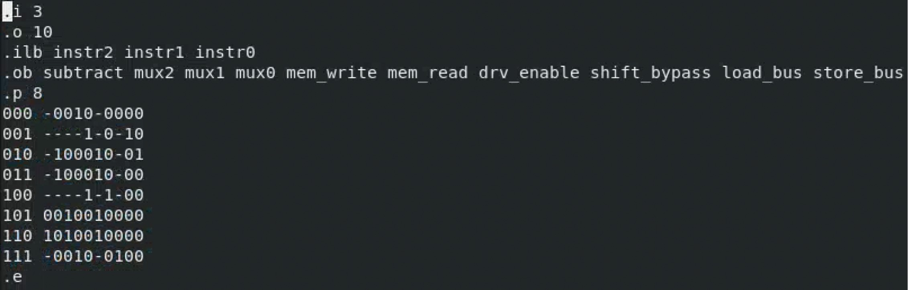<br>
<em>Fig. 5. Instruction decoder PLA input file.</em>
</div>

<br>

The input PLA file was then processed with Espresso to generate the minimized output file, `Espresso_files/instr_decoder_out.pla`. Espresso preserves the same input and output interface while replacing selected opcode-specific rows with shared implicants, such as `-00`, `0-1`, `-01`, and `1-0`. These minimized product terms reduce the amount of logic required by the instruction decoder.

<div align="center">
<br>
<em>Fig. 6. Espresso-minimized instruction decoder PLA output file.</em>
</div>

<br>

The Espresso-minimized output was used to build the instruction-decoder PLA symbol, schematic, and layout. The symbol provides the block-level interface, the schematic maps the minimized product terms to the decoded control outputs, and the final layout implements the same logic in a regular row-and-column PLA structure.

<div align="center">
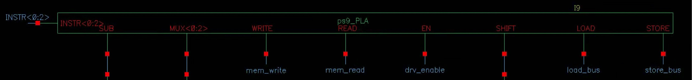<br>
<em>Fig. 7. PLA symbol.</em>
</div>

<div align="center">
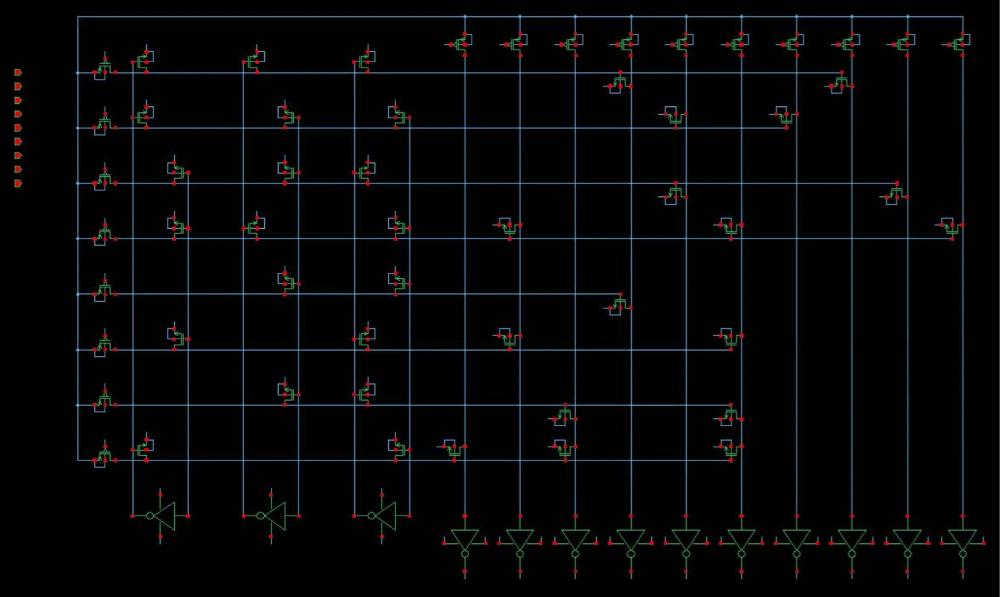<br>
<em>Fig. 8. PLA schematic.</em>
</div>

<div align="center">
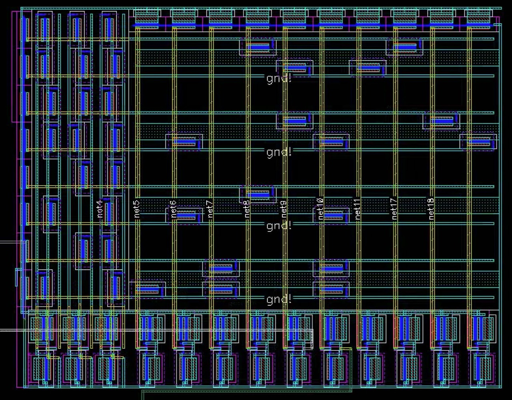<br>
<em>Fig. 9. PLA layout.</em>
</div>

<br>

### B. Control-Signal Latch

The control-signal latch stores selected outputs from the PLA so that datapath control remains stable during evaluation. The symbol defines the block-level interface, the schematic connects the latch stages used for subtraction, multiplexer selection, and shift control, and the layout implements the same control-storage structure physically. The inverter and latch-cell schematics and layouts are shown separately because they are the repeated cells used to construct the full control-signal latch.

<div align="center">
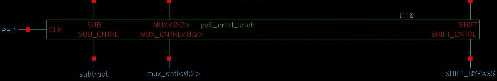<br>
<em>Fig. 10. Control-signal latch symbol.</em>
</div>

<div align="center">
<br>
<em>Fig. 11. Control-signal latch schematic.</em>
</div>

<div align="center">
<br>
<em>Fig. 12. Control-signal latch layout.</em>
</div>

<br>

The control-signal latch is built from one inverter cell and five latch cells. The inverter cell generates the complementary control phase required by the latch stages, while each latch cell stores one decoded control bit from the PLA. Reusing the latch cell keeps the control block modular and makes the schematic-to-layout correspondence clear: the cell schematics define the transistor-level storage behavior, and the cell layouts are tiled and connected to form the complete control-signal latch.

<table>
<tr>
<td align="center">
<br>
<em>Fig. 13. Inverter schematic used in the control latch.</em>
</td>
<td align="center">
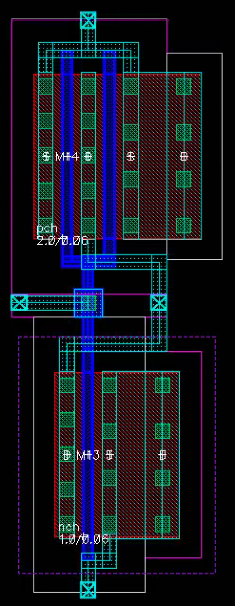<br>
<em>Fig. 14. Inverter layout used in the control latch.</em>
</td>
</tr>
</table>

<table>
<tr>
<td align="center">
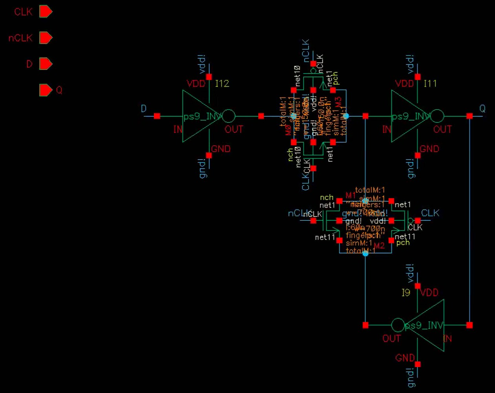<br>
<em>Fig. 15. Latch schematic used in the control latch.</em>
</td>
<td align="center">
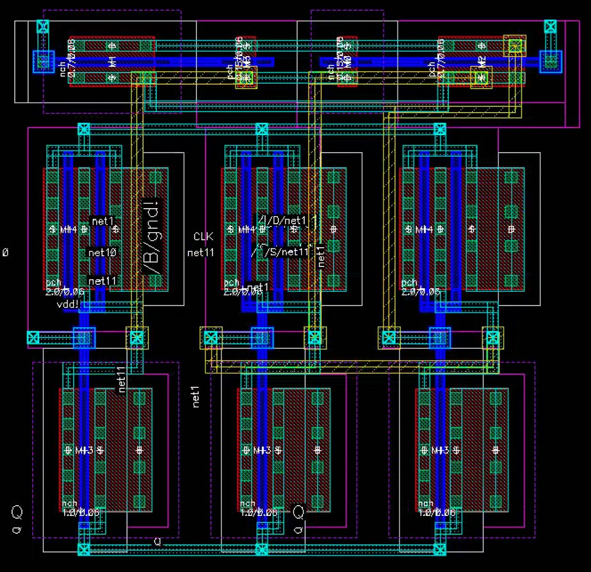<br>
<em>Fig. 16. Latch layout used in the control latch.</em>
</td>
</tr>
</table>

<br>

### C. SRAM Block

The SRAM stores eight 8-bit words and provides the memory interface for `LOAD`, `STORE`, arithmetic, and shift operations. The block includes the top-level SRAM symbol, schematic, and layout, along with the core array, decoder, precharge, write, and read circuits.

<div align="center">
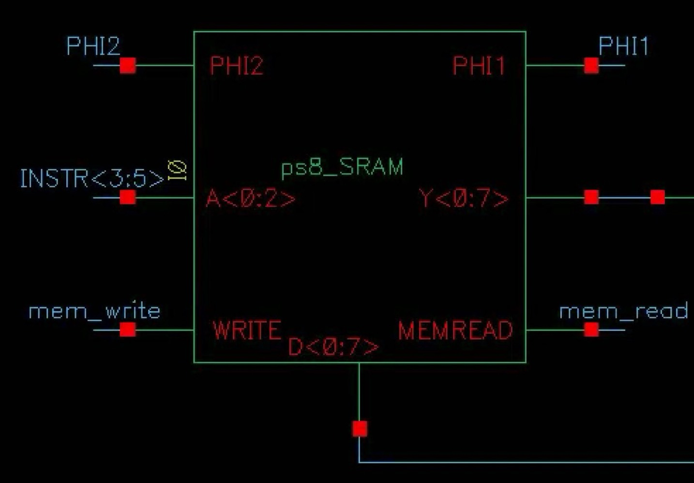<br>
<em>Fig. 17. SRAM symbol.</em>
</div>

<div align="center">
<br>
<em>Fig. 18. SRAM schematic.</em>
</div>

<div align="center">
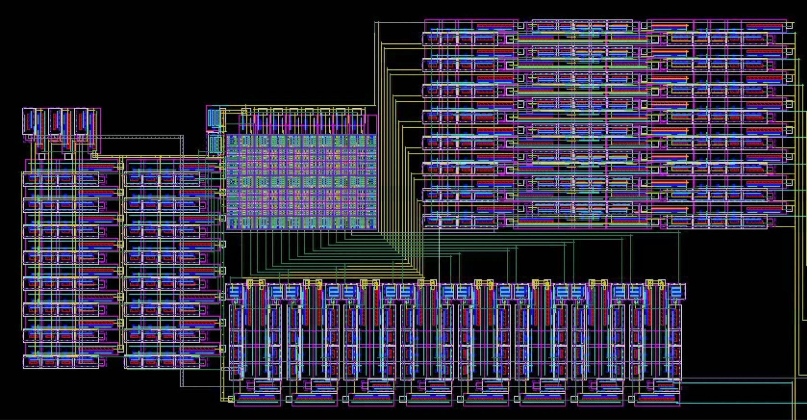<br>
<em>Fig. 19. SRAM layout.</em>
</div>

At the core level, the SRAM contains the 8-by-8 memory array and connects it to the surrounding peripheral circuits. The core schematic and layout show how the storage array is organized before it is integrated with the decoder, precharge, write, and read blocks.

<table>
<tr>
<td align="center">
<br>
<em>Fig. 20. SRAM core schematic.</em>
</td>
<td align="center">
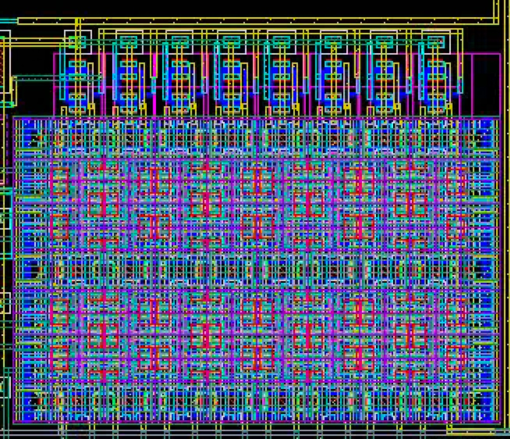<br>
<em>Fig. 21. SRAM core layout.</em>
</td>
</tr>
</table>

The decoder selects one SRAM row from the address bits. Its schematic and layout are shown together to compare the row-selection logic with the physical decoder implementation.

<table>
<tr>
<td align="center">
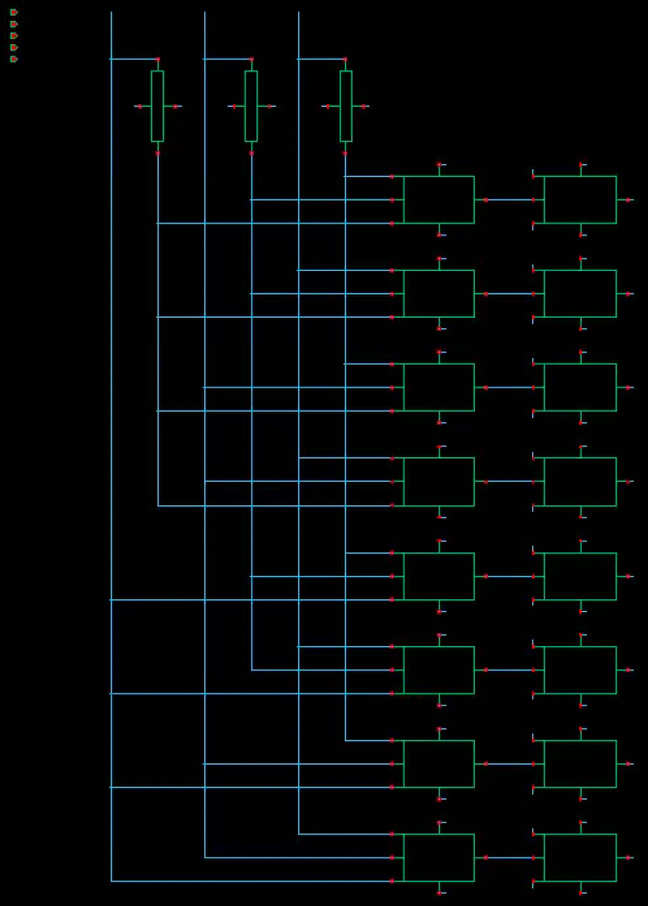<br>
<em>Fig. 22. SRAM decoder schematic.</em>
</td>
<td align="center">
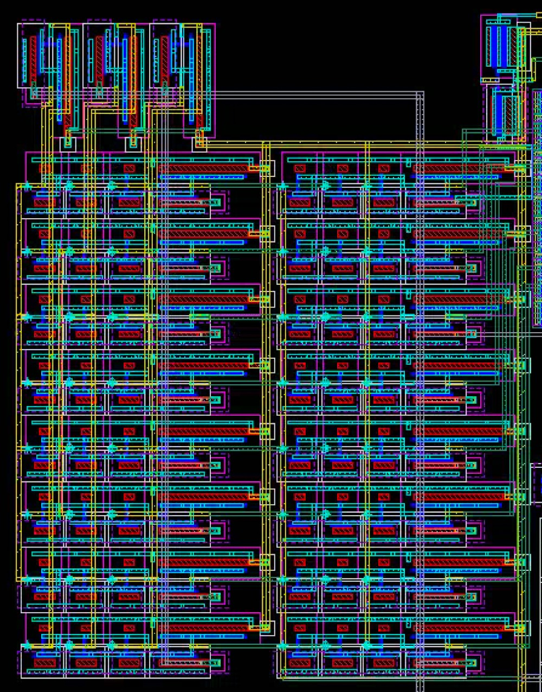<br>
<em>Fig. 23. SRAM decoder layout.</em>
</td>
</tr>
</table>

<div align="center">
<br>
<em>Fig. 24. SRAM decoder inverter schematic.</em>
</div>

<div align="center">
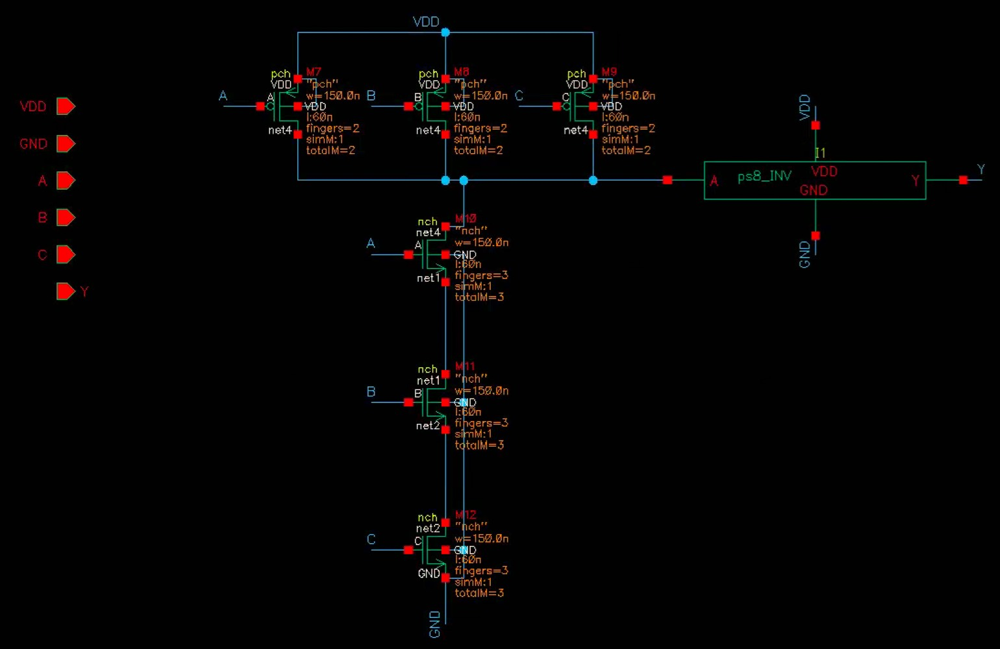<br>
<em>Fig. 25. SRAM decoder three-input AND schematic.</em>
</div>

The decoder layout is built from reusable inverter and three-input AND cells, which generate the decoded word-line signals used to select the target SRAM row. After row selection, the precharge circuit initializes the bit lines before read and write activity.

<div align="center">
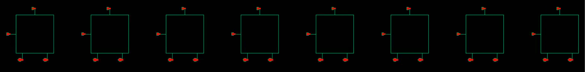<br>
<em>Fig. 26. SRAM precharge schematic.</em>
</div>

<div align="center">
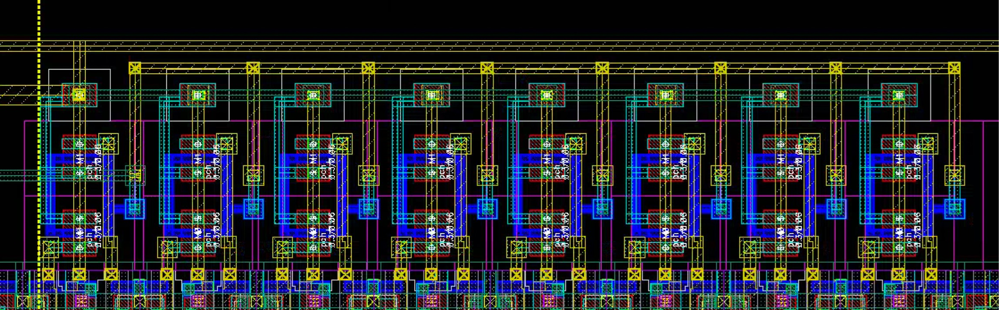<br>
<em>Fig. 27. SRAM precharge layout.</em>
</div>

<div align="center">
<br>
<em>Fig. 28. One-bit SRAM precharge schematic.</em>
</div>

The write circuit drives the selected SRAM column during memory-update operations. The full write schematic and layout show the column-level implementation, while the one-bit schematic shows the repeated write cell used across the 8-bit data path.

<div align="center">
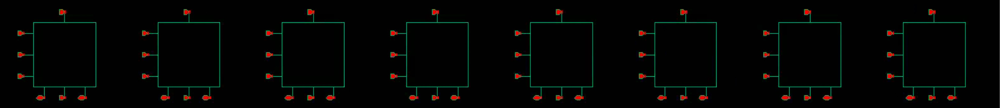<br>
<em>Fig. 29. SRAM write schematic.</em>
</div>

<div align="center">
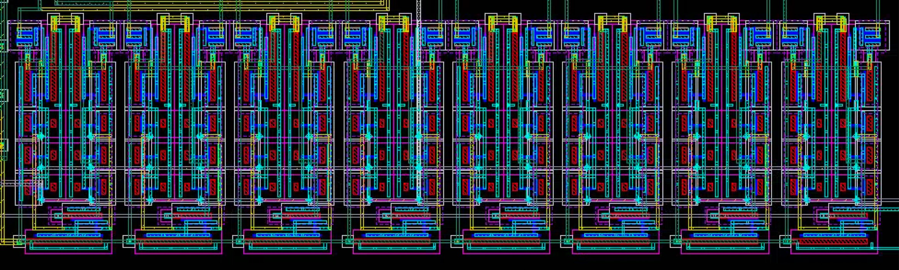<br>
<em>Fig. 30. SRAM write layout.</em>
</div>

<div align="center">
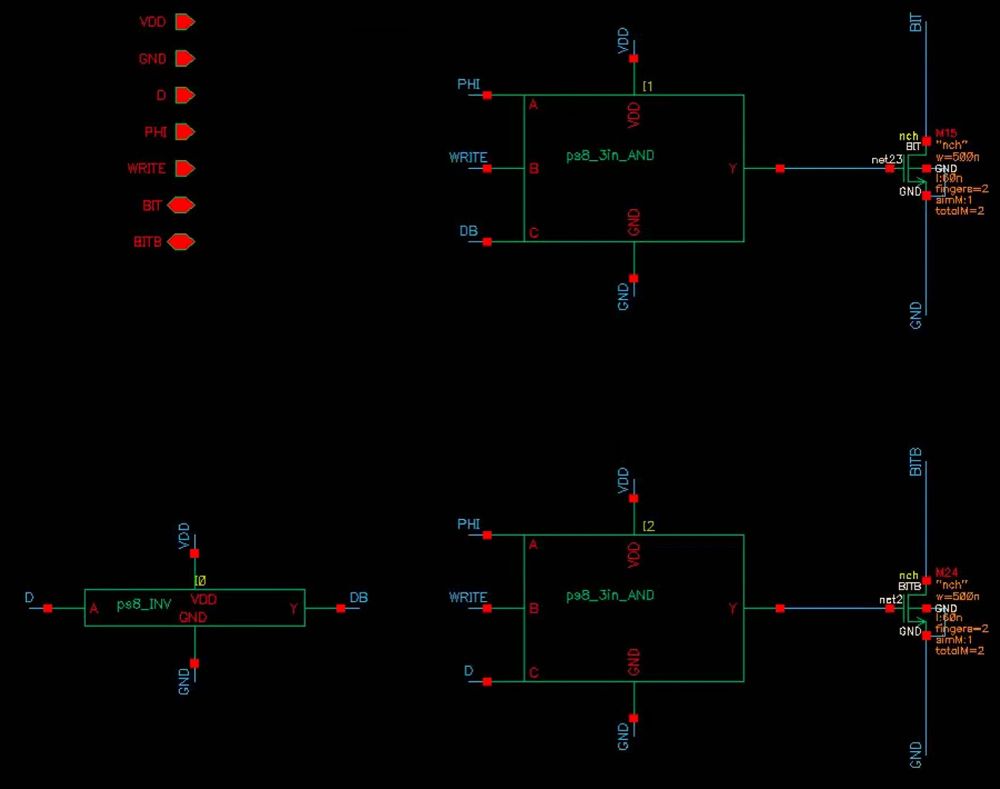<br>
<em>Fig. 31. One-bit SRAM write schematic.</em>
</div>

The read circuit senses the selected SRAM column and drives the internal data path during memory-read operations. The full read schematic and layout show the complete read path, and the one-bit schematic shows the repeated cell used for each data bit.

<div align="center">
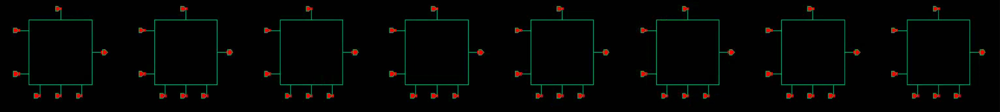<br>
<em>Fig. 32. SRAM read schematic.</em>
</div>

<div align="center">
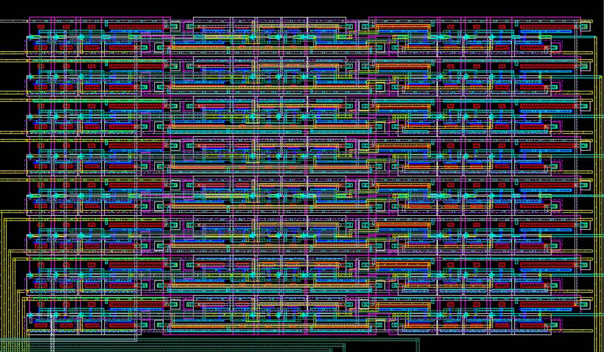<br>
<em>Fig. 33. SRAM read layout.</em>
</div>

<div align="center">
<br>
<em>Fig. 34. One-bit SRAM read schematic.</em>
</div>

<br>

### D. Datapath Block

The datapath includes the adder/subtractor, shifter, multiplexer, and accumulator latch. The arithmetic block generates the 8-bit result, carry flag, and overflow flag. The shifter and multiplexer route the selected value into the accumulator latch.

<div align="center">
<br>
<em>Fig. 35. Adder/subtractor layout.</em>
</div>

<div align="center">
<br>
<em>Fig. 36. Shifter layout.</em>
</div>

<div align="center">
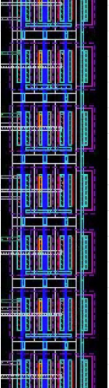<br>
<em>Fig. 37. Multiplexer layout.</em>
</div>

<div align="center">
<br>
<em>Fig. 38. Accumulator latch layout.</em>
</div>

<br>

## V. Functional Verification

### A. Test Operation Table

The transient test sequence loads memory with known values, executes accumulator and arithmetic operations, verifies shift behavior, and stores the final memory values on the external bus.

| Step | Operation | `INSTR` | Memory Address | Binary Value | Decimal Value | `C` | `OV` | `SHIFT<2:0>` |
| ---: | --- | --- | ---: | --- | ---: | ---: | ---: | --- |
| 1 | `LOAD` | `001b` | 0 | `00000000b` | 0 |  |  |  |
| 2 | `LOAD` | `001b` | 1 | `01001001b` | 73 |  |  |  |
| 3 | `LOAD` | `001b` | 2 | `10010010b` | -110 |  |  |  |
| 4 | `LOAD` | `001b` | 3 | `11011011b` | -37 |  |  |  |
| 5 | `LOAD` | `001b` | 4 | `00100100b` | 36 |  |  |  |
| 6 | `LOAD` | `001b` | 5 | `01101101b` | 109 |  |  |  |
| 7 | `LOAD` | `001b` | 6 | `10110110b` | -74 |  |  |  |
| 8 | `LOAD` | `001b` | 7 | `11111111b` | -1 |  |  |  |
| 9 | `NOP` | `000b` | 0 |  |  |  |  |  |
| 10 | `GET` | `011b` | 3 | `11011011b` | -37 |  |  |  |
| 11 | `ADD` | `101b` | 4 | `00100100b` | 36 | 0 | 0 |  |
| 12 | `PUT` | `100b` | 0 | `11111111b` | -1 |  |  |  |
| 13 | `NOP` | `000b` | 0 |  |  |  |  |  |
| 14 | `GET` | `011b` | 1 | `01001001b` | 73 |  |  |  |
| 15 | `ADD` | `101b` | 5 | `01101101b` | 109 | 0 | 1 |  |
| 16 | `PUT` | `100b` | 1 | `10110110b` | -74 |  |  |  |
| 17 | `NOP` | `000b` | 0 |  |  |  |  |  |
| 18 | `GET` | `011b` | 5 | `01101101b` | 109 |  |  |  |
| 19 | `SUB` | `110b` | 4 | `00100100b` | 36 | 1 | 0 |  |
| 20 | `PUT` | `100b` | 2 | `01001001b` | 73 |  |  |  |
| 21 | `NOP` | `000b` | 0 |  |  |  |  |  |
| 22 | `GET` | `011b` | 3 | `11011011b` | -37 |  |  |  |
| 23 | `SUB` | `110b` | 5 | `01101101b` | 109 | 1 | 1 |  |
| 24 | `PUT` | `100b` | 3 | `01101110b` | 110 |  |  |  |
| 25 | `NOP` | `000b` | 0 |  |  |  |  |  |
| 26 | `GET` | `011b` | 0 | `11111111b` | -1 |  |  |  |
| 27 | `SHIFT` | `111b` | 0 |  |  |  |  | `011` |
| 28 | `PUT` | `100b` | 4 | `11111000b` | -8 |  |  |  |
| 29 | `NOP` | `000b` | 0 |  |  |  |  |  |
| 30 | `GET` | `011b` | 3 | `01101110b` | 110 |  |  |  |
| 31 | `SHIFT` | `111b` | 0 |  |  |  |  | `101` |
| 32 | `PUT` | `100b` | 5 | `11000000b` | -64 |  |  |  |
| 33 | `STORE` | `010b` | 0 | `11111111b` | -1 |  |  |  |
| 34 | `STORE` | `010b` | 1 | `10110110b` | -74 |  |  |  |
| 35 | `STORE` | `010b` | 2 | `01001001b` | 73 |  |  |  |
| 36 | `STORE` | `010b` | 3 | `01101110b` | 110 |  |  |  |
| 37 | `STORE` | `010b` | 4 | `11111000b` | -8 |  |  |  |
| 38 | `STORE` | `010b` | 5 | `11000000b` | -64 |  |  |  |
| 39 | `STORE` | `010b` | 6 | `10110110b` | -74 |  |  |  |
| 40 | `STORE` | `010b` | 7 | `11111111b` | -1 |  |  |  |

<div align="center"><strong>Table 3. Functional Verification Test Sequence</strong></div>

<br>

### B. Waveform Results

The instruction waveform verifies the applied opcode and address fields. The external bus waveform confirms that memory load values are accepted and that store operations reproduce the expected output sequence.

<div align="center">
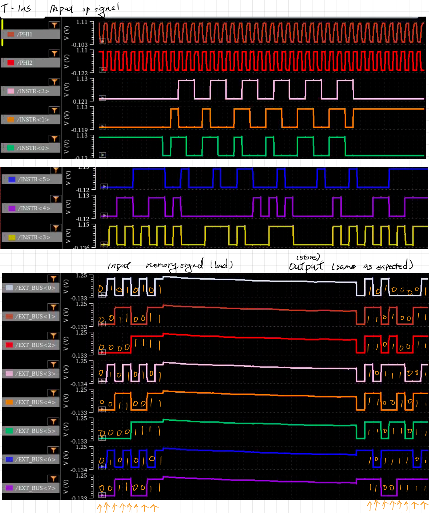<br>
<em>Fig. 39. Instruction and external bus waveform verification.</em>
</div>

<br>

The status and shift waveforms verify `SHIFT_BYPASS`, carry, overflow, and shift-control behavior. The delay plot compares `PHI1` and `EXT_BUS<0>` around a representative output transition.

<div align="center">
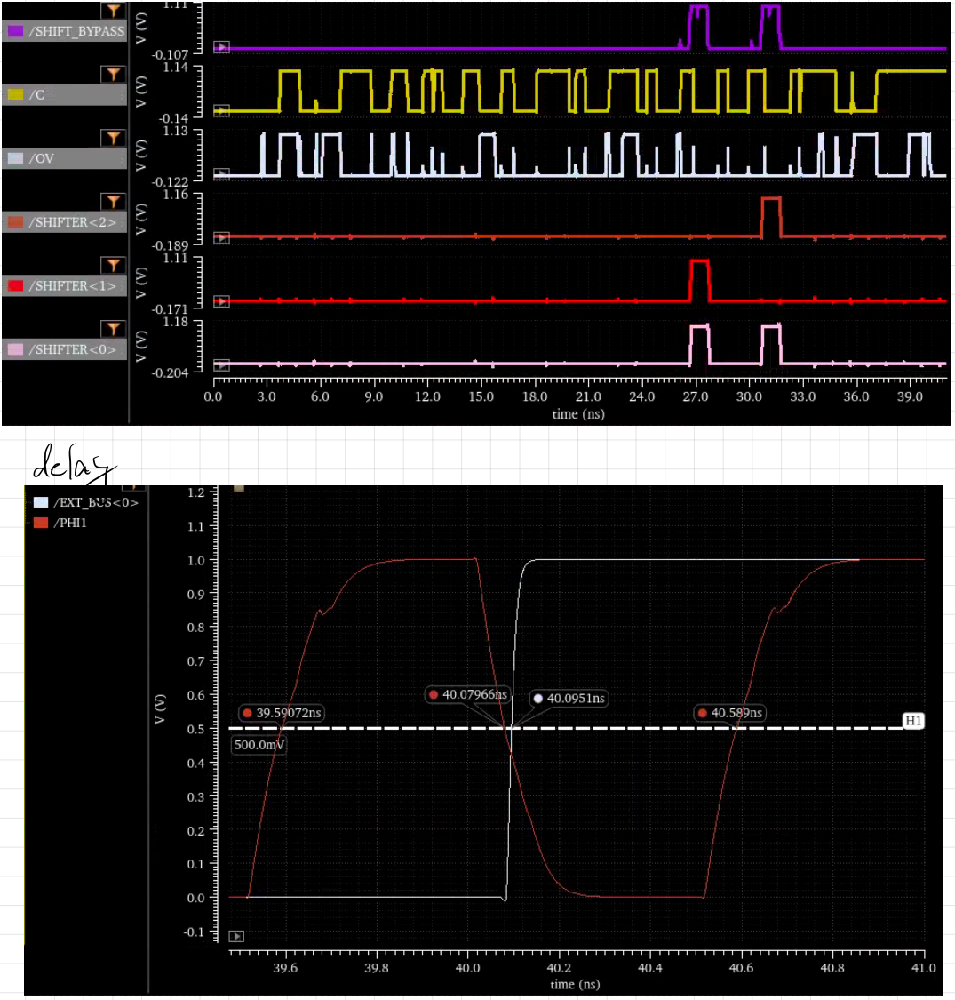<br>
<em>Fig. 40. Shift, carry, overflow, and delay waveform verification.</em>
</div>

<br>

### C. Delay Measurement

A representative timing measurement compares `PHI1` and `EXT_BUS<0>` at the 500 mV crossing. Based on the plotted cursor values, the output transition follows the clock transition by approximately 15 ps.

```text
PHI1 reference crossing ~= 40.080 ns
EXT_BUS<0> crossing     ~= 40.095 ns
Measured delay          ~= 15 ps
```

## VI. Design File Package

| File or Directory | Purpose |
| --- | --- |
| `EECS4321_Submission/eecs4321_submission.pdf` | Final submission report |
| `EECS4321_Submission/project_requirements.pdf` | Project requirements/reference PDF |
| `Layout_files/ps9_Microprocessor.gds` | Final microprocessor layout database |
| `figures/` | Schematic, layout, DRC/LVS, and waveform figures used by this report |
| `VLSI_Project_Report.md` | DAC-style Markdown version of the microprocessor report |

<div align="center"><strong>Table 4. Design File Package</strong></div>

<br>

## VII. Conclusion

A full-custom 8-bit microprocessor core in 65 nm CMOS was implemented and verified at the layout level. The design integrates instruction decoding, control latching, SRAM, arithmetic, shifting, accumulator storage, and external bus transfer logic. The included schematic and layout figures document the completed design hierarchy and physical blocks, while the DRC and LVS captures confirm design-rule correctness and schematic-layout equivalence.

Functional transient simulation verifies the instruction sequence, memory loading, arithmetic operations, shift control, bus store behavior, carry and overflow outputs, and representative output timing.

## References

[1] Yi-Hsiang Wei and Zijian Shang, "Ps9 Microprocessor," project report PDF, 2025.
