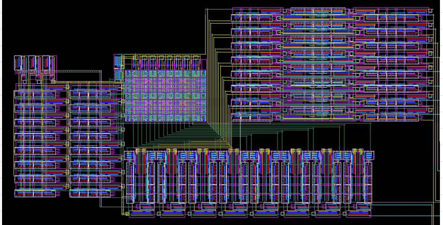
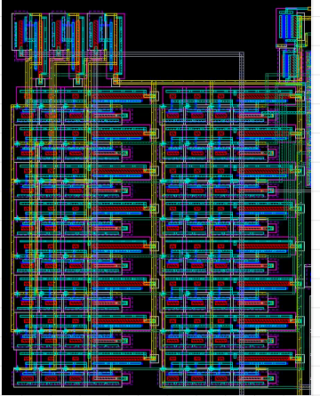
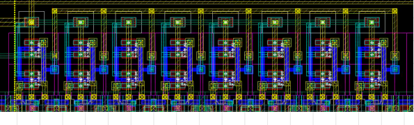
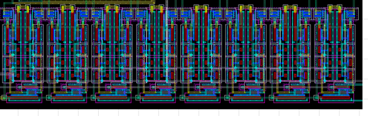
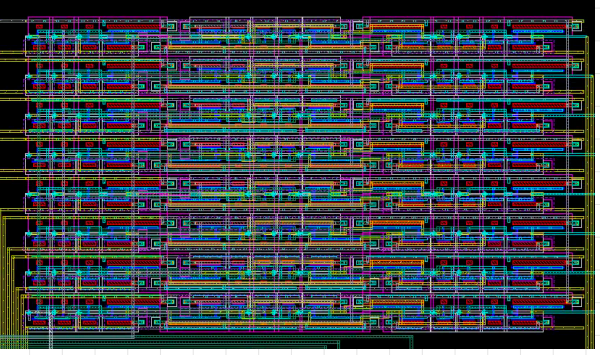
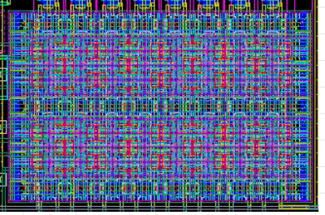
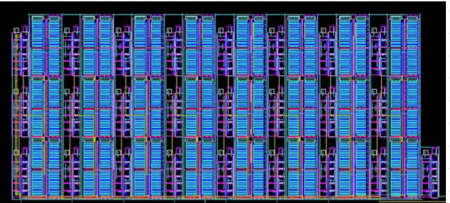
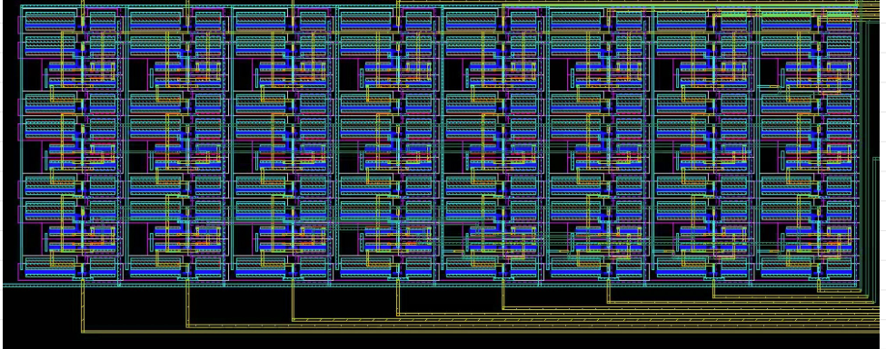
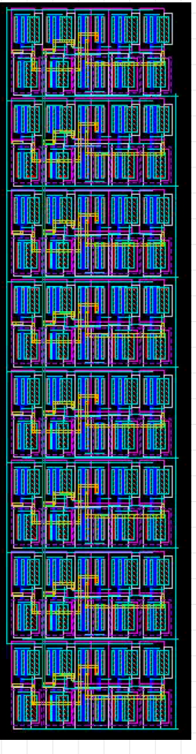

# Full-Custom 8-Bit Microprocessor Core in 65 nm CMOS

Yi-Hsiang Wei and Zijian Shang  
Department of Electrical Engineering, Columbia University  
VLSI Design Project

## Abstract

This report presents the layout, physical verification, and waveform-level functional verification of a full-custom 8-bit microprocessor core in 65 nm CMOS. The processor integrates a PLA-based instruction decoder, a control-signal latch, an 8x8 SRAM, an arithmetic datapath, a shifter, an accumulator latch, a multiplexer, and a bidirectional external-bus interface.

The instruction set supports eight operations: `NOP`, `LOAD`, `STORE`, `GET`, `PUT`, `ADD`, `SUB`, and `SHIFT`. The included figures document the top-level schematic, layout views, DRC/LVS verification captures, and transient waveform results.

## I. Introduction

The goal of this project is to design and verify a compact full-custom 8-bit microprocessor core. The processor operates on 8-bit data words and uses a 3-bit opcode and memory-address bits to select memory, arithmetic, shift, and external-bus operations.

The major top-level signals are summarized below.

| Signal | Direction | Description |
| --- | --- | --- |
| `PHI1`, `PHI2` | Input | Two-phase clock signals |
| `INSTR<0:5>` | Input | Instruction code containing opcode and memory-address fields |
| `EXT_BUS<0:7>` | Bidirectional | External 8-bit data bus |
| `SHIFT_BYPASS` | Control | Selects shift-bypass mode |
| `C` | Output | Carry flag |
| `OV` | Output | Overflow flag |

<div align="center"><strong>Table 1. Top-Level Signal Summary</strong></div>

<br>

## II. Architecture

### A. Top-Level Datapath

The top-level schematic and layout show the complete processor hierarchy. The datapath connects the SRAM, accumulator latch, arithmetic unit, shifter, multiplexer, and external-bus driver, while the control path decodes `INSTR<0:2>` and latches timing-sensitive control signals for datapath evaluation.

<div align="center">
<br>
<em>Fig. 1. Top-level microprocessor schematic.</em>
</div>

<div align="center">
<br>
<em>Fig. 2. Top-level microprocessor layout.</em>
</div>

<br>

The external bus can load memory during `LOAD` or receive stored data during `STORE`. Arithmetic operations use the accumulator and SRAM data as operands.

### B. Instruction Set and Control Table

The opcode and decoded control behavior are summarized in Table 2.

| Instruction | Opcode | Function | `SUB` | `MUX2 (SRAM)` | `MUX1 (Adder)` | `MUX0 (Shifter)` | `MEM_WRITE` | `MEM_READ` | `DRV_EN` | `SHIFT_BYPASS` | `LOAD_BUS` | `STORE_BUS` |
| --- | --- | --- | ---: | ---: | ---: | ---: | ---: | ---: | ---: | ---: | ---: | ---: |
| `NOP` | `000` | No&nbsp;operation | - | 0 | 0 | 1 | 0 | - | 0 | 0 | 0 | 0 |
| `LOAD` | `001` | Mem[`i`]&nbsp;&lt;-&nbsp;External&nbsp;Bus | - | - | - | - | 1 | - | 0 | - | 1 | 0 |
| `STORE` | `010` | External&nbsp;Bus&nbsp;&lt;-&nbsp;Mem[`i`] | - | 1 | 0 | 0 | 0 | 1 | 0 | - | 0 | 1 |
| `GET` | `011` | Acc&nbsp;&lt;-&nbsp;Mem[`i`] | - | 1 | 0 | 0 | 0 | 1 | 0 | - | 0 | 0 |
| `PUT` | `100` | Mem[`i`]&nbsp;&lt;-&nbsp;Acc | - | - | - | - | 1 | - | 1 | - | 0 | 0 |
| `ADD` | `101` | Acc&nbsp;&lt;-&nbsp;Acc&nbsp;+&nbsp;Mem[`i`] | 0 | 0 | 1 | 0 | 0 | 1 | 0 | 0 | 0 | 0 |
| `SUB` | `110` | Acc&nbsp;&lt;-&nbsp;Acc&nbsp;-&nbsp;Mem[`i`] | 1 | 0 | 1 | 0 | 0 | 1 | 0 | 0 | 0 | 0 |
| `SHIFT` | `111` | Shift&nbsp;accumulator&nbsp;left&nbsp;by&nbsp;`i` | - | 0 | 0 | 1 | 0 | - | 0 | 1 | 0 | 0 |

<div align="center"><strong>Table 2. Instruction Set and Control Signals</strong></div>

<br>

## III. Physical Verification

The completed top-level layout passes DRC and LVS. The DRC result reports no rule violations, and LVS reports a successful comparison between the extracted layout and schematic netlists. The final layout is included in `Layout_files/ps9_Microprocessor.gds`.

<table>
<tr>
<td align="center">
<br>
<em>Fig. 3. DRC result.</em>
</td>
<td align="center">
<br>
<em>Fig. 4. LVS result.</em>
</td>
</tr>
</table>

<br>

## IV. Implementation

### A. PLA Block

The instruction decoder design begins with the control behavior summarized in Table 2. The control table was translated into the Espresso input file `Espresso_files/instr_decoder.pla`, which defines three opcode inputs, `instr2`, `instr1`, and `instr0`, and ten decoded control outputs: `subtract`, `mux2`, `mux1`, `mux0`, `mem_write`, `mem_read`, `drv_enable`, `shift_bypass`, `load_bus`, and `store_bus`. Don't-care entries are used wherever a control value is unused, allowing Espresso to optimize those outputs rather than forcing them to fixed logic levels.

<div align="center">
<br>
<em>Fig. 5. Instruction decoder PLA input file.</em>
</div>

<br>

The input PLA file was then passed through Espresso to generate the minimized output file, `Espresso_files/instr_decoder_out.pla`. Espresso preserves the same input/output interface while replacing selected opcode-specific rows with shared implicants, such as `-00`, `0-1`, `-01`, and `1-0`. These minimized product terms reduce the amount of logic required in the instruction-decoder PLA.

<div align="center">
<br>
<em>Fig. 6. Espresso-minimized instruction decoder PLA output file.</em>
</div>

<br>

The Espresso-minimized output was used to build the instruction-decoder PLA symbol and schematic. The symbol provides the block-level interface, the schematic maps the minimized product terms to the decoded control outputs, and the final layout implements the same logic as a regular row-column PLA.

<div align="center">
<br>
<em>Fig. 7. PLA symbol.</em>
</div>

<div align="center">
<br>
<em>Fig. 8. PLA schematic.</em>
</div>

<div align="center">
<br>
<em>Fig. 9. PLA layout.</em>
</div>

<br>

### B. Control Latch Block

The control latch stores the selected PLA outputs so that datapath control remains stable during evaluation. The symbol defines the block interface, the schematic connects the latch stages for subtraction, multiplexer selection, and shift control, and the layout implements those stages physically. The inverter and latch cell schematics and layouts are shown separately because they form the repeated cells used inside the control-latch block.

<div align="center">
<br>
<em>Fig. 10. Control-signal latch symbol.</em>
</div>

<div align="center">
<br>
<em>Fig. 11. Control-signal latch schematic.</em>
</div>

<div align="center">
<br>
<em>Fig. 12. Control-signal latch layout.</em>
</div>

<table>
<tr>
<td align="center">
<br>
<em>Fig. 13. Inverter schematic used in the control latch.</em>
</td>
<td align="center">
<br>
<em>Fig. 14. Inverter layout used in the control latch.</em>
</td>
</tr>
</table>

<table>
<tr>
<td align="center">
<br>
<em>Fig. 15. Latch schematic used in the control latch.</em>
</td>
<td align="center">
<br>
<em>Fig. 16. Latch layout used in the control latch.</em>
</td>
</tr>
</table>

<br>

### C. SRAM Block

The SRAM stores eight 8-bit words. It includes address decoding, bit-line precharge, write circuitry, read circuitry, and the 8x8 memory array.

<div align="center">
<br>
<em>Fig. 17. SRAM block layout.</em>
</div>

<div align="center">
<br>
<em>Fig. 18. SRAM decoder layout.</em>
</div>

<div align="center">
<br>
<em>Fig. 19. SRAM precharge circuit layout.</em>
</div>

<div align="center">
<br>
<em>Fig. 20. SRAM write circuit layout.</em>
</div>

<div align="center">
<br>
<em>Fig. 21. SRAM read circuit layout.</em>
</div>

<div align="center">
<br>
<em>Fig. 22. 8x8 SRAM array layout.</em>
</div>

<br>

### D. Datapath Block

The datapath includes the adder/subtractor, shifter, multiplexer, and accumulator latch. The arithmetic block generates the 8-bit result, carry flag, and overflow flag. The shifter and multiplexer route the selected value into the accumulator latch.

<div align="center">
<br>
<em>Fig. 23. Adder/subtractor layout.</em>
</div>

<div align="center">
<br>
<em>Fig. 24. Shifter layout.</em>
</div>

<div align="center">
<br>
<em>Fig. 25. Multiplexer layout.</em>
</div>

<div align="center">
<br>
<em>Fig. 26. Accumulator latch layout.</em>
</div>

<br>

## V. Functional Verification

### A. Test Operation Table

The transient test sequence loads memory with known values, executes accumulator and arithmetic operations, verifies shift behavior, and stores the final memory values on the external bus.

| Step | Operation | `INSTR` | Memory Address | Binary Value | Decimal Value | `C` | `OV` | `SHIFT<2:0>` |
| ---: | --- | --- | ---: | --- | ---: | ---: | ---: | --- |
| 1 | `LOAD` | `001b` | 0 | `00000000b` | 0 |  |  |  |
| 2 | `LOAD` | `001b` | 1 | `01001001b` | 73 |  |  |  |
| 3 | `LOAD` | `001b` | 2 | `10010010b` | -110 |  |  |  |
| 4 | `LOAD` | `001b` | 3 | `11011011b` | -37 |  |  |  |
| 5 | `LOAD` | `001b` | 4 | `00100100b` | 36 |  |  |  |
| 6 | `LOAD` | `001b` | 5 | `01101101b` | 109 |  |  |  |
| 7 | `LOAD` | `001b` | 6 | `10110110b` | -74 |  |  |  |
| 8 | `LOAD` | `001b` | 7 | `11111111b` | -1 |  |  |  |
| 9 | `NOP` | `000b` | 0 |  |  |  |  |  |
| 10 | `GET` | `011b` | 3 | `11011011b` | -37 |  |  |  |
| 11 | `ADD` | `101b` | 4 | `00100100b` | 36 | 0 | 0 |  |
| 12 | `PUT` | `100b` | 0 | `11111111b` | -1 |  |  |  |
| 13 | `NOP` | `000b` | 0 |  |  |  |  |  |
| 14 | `GET` | `011b` | 1 | `01001001b` | 73 |  |  |  |
| 15 | `ADD` | `101b` | 5 | `01101101b` | 109 | 0 | 1 |  |
| 16 | `PUT` | `100b` | 1 | `10110110b` | -74 |  |  |  |
| 17 | `NOP` | `000b` | 0 |  |  |  |  |  |
| 18 | `GET` | `011b` | 5 | `01101101b` | 109 |  |  |  |
| 19 | `SUB` | `110b` | 4 | `00100100b` | 36 | 1 | 0 |  |
| 20 | `PUT` | `100b` | 2 | `01001001b` | 73 |  |  |  |
| 21 | `NOP` | `000b` | 0 |  |  |  |  |  |
| 22 | `GET` | `011b` | 3 | `11011011b` | -37 |  |  |  |
| 23 | `SUB` | `110b` | 5 | `01101101b` | 109 | 1 | 1 |  |
| 24 | `PUT` | `100b` | 3 | `01101110b` | 110 |  |  |  |
| 25 | `NOP` | `000b` | 0 |  |  |  |  |  |
| 26 | `GET` | `011b` | 0 | `11111111b` | -1 |  |  |  |
| 27 | `SHIFT` | `111b` | 0 |  |  |  |  | `011` |
| 28 | `PUT` | `100b` | 4 | `11111000b` | -8 |  |  |  |
| 29 | `NOP` | `000b` | 0 |  |  |  |  |  |
| 30 | `GET` | `011b` | 3 | `01101110b` | 110 |  |  |  |
| 31 | `SHIFT` | `111b` | 0 |  |  |  |  | `101` |
| 32 | `PUT` | `100b` | 5 | `11000000b` | -64 |  |  |  |
| 33 | `STORE` | `010b` | 0 | `11111111b` | -1 |  |  |  |
| 34 | `STORE` | `010b` | 1 | `10110110b` | -74 |  |  |  |
| 35 | `STORE` | `010b` | 2 | `01001001b` | 73 |  |  |  |
| 36 | `STORE` | `010b` | 3 | `01101110b` | 110 |  |  |  |
| 37 | `STORE` | `010b` | 4 | `11111000b` | -8 |  |  |  |
| 38 | `STORE` | `010b` | 5 | `11000000b` | -64 |  |  |  |
| 39 | `STORE` | `010b` | 6 | `10110110b` | -74 |  |  |  |
| 40 | `STORE` | `010b` | 7 | `11111111b` | -1 |  |  |  |

<div align="center"><strong>Table 3. Functional Verification Test Sequence</strong></div>

<br>

### B. Waveform Results

The instruction waveform verifies the applied opcode and address fields. The external-bus waveform verifies that memory load values are accepted and that store operations reproduce the expected output sequence.

<div align="center">
<br>
<em>Fig. 27. Instruction and external bus waveform verification.</em>
</div>

<br>

The status and shift waveforms verify `SHIFT_BYPASS`, carry, overflow, and shift-control behavior. The delay plot compares `PHI1` and `EXT_BUS<0>` around a representative output transition.

<div align="center">
<br>
<em>Fig. 28. Shift, carry, overflow, and delay waveform verification.</em>
</div>

<br>

### C. Delay Measurement

A representative timing measurement compares `PHI1` and `EXT_BUS<0>` at the 500 mV crossing. From the plotted cursor values, the output transition follows the clock transition by approximately 15 ps.

```text
PHI1 reference crossing ~= 40.080 ns
EXT_BUS<0> crossing     ~= 40.095 ns
Measured delay          ~= 15 ps
```

## VI. Design File Package

| File or Directory | Purpose |
| --- | --- |
| `EECS4321_Submission/eecs4321_submission.pdf` | Final submission report |
| `EECS4321_Submission/project_requirements.pdf` | Project requirements/reference PDF |
| `Layout_files/ps9_Microprocessor.gds` | Final microprocessor layout database |
| `figures/` | Schematic, layout, DRC/LVS, and waveform figures used by this report |
| `VLSI_Project_Report.md` | DAC-style Markdown version of the microprocessor report |

<div align="center"><strong>Table 4. Design File Package</strong></div>

<br>

## VII. Conclusion

A full-custom 8-bit microprocessor core in 65 nm CMOS was implemented and verified at the layout level. The design integrates instruction decoding, control latching, SRAM, arithmetic, shifting, accumulator storage, and external-bus transfer logic. The included schematic and layout figures document the completed design hierarchy and physical blocks, while the DRC and LVS captures confirm physical-rule correctness and schematic-layout equivalence.

Functional transient simulation verifies the instruction sequence, memory loading, arithmetic operations, shift control, bus store behavior, carry and overflow outputs, and representative output timing.

## References

[1] Yi-Hsiang Wei and Zijian Shang, "Ps9 Microprocessor," project report PDF, 2025.
